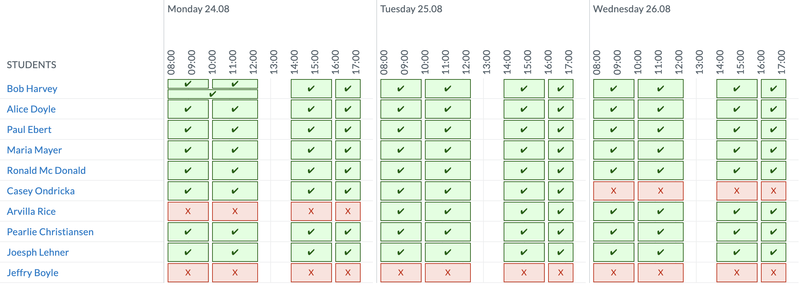
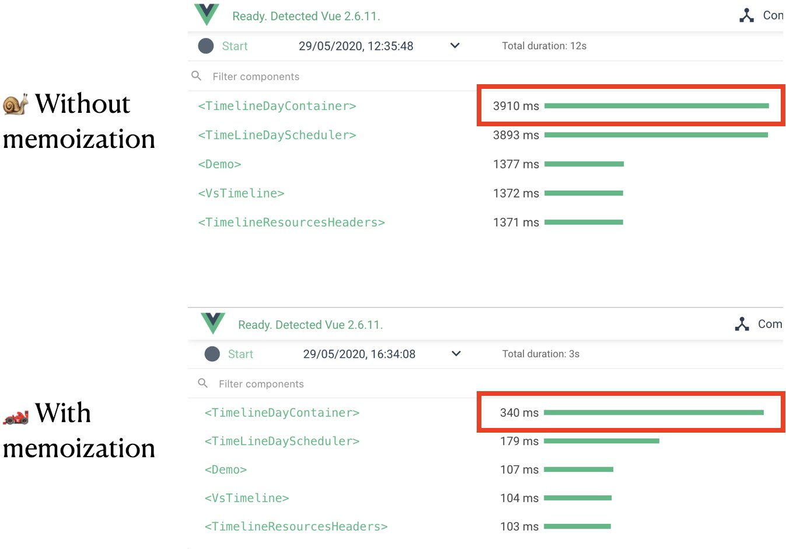

A few weeks ago, memoization helped me to fix a performance issue in my Vue.js application. The
result looks like a _"Vue.js computed property with parameters"_, although it's not possible!

## The problem

The problem appeared in this big timeline component.



To make it short:

- 1 line = 1 week of events for one person;
- events may overlap (Bob has one on Monday morning).

To position an event on the grid (left, width, top, height/lineHeight), I have to call a function to
compute if this event overlaps with another one. **This function was called many times and sometimes
with the same parameters.**

This component used to work nicely _on my local environment™️._

But, with more events/day (≃ more squares) and more users (≃ more rows), it was a different story.
The component was taking ~4 to ~6 seconds to show up. I added a `console.count()` and I realized
that my function was called +700 times! 🙈

My first call was to use `computed()`, **a cached property (based on their reactive dependencies)**.
Unfortunately, they're not working with parameters. In other words, you cannot do that:

```js
export default {
  data: () => ({
    events: [
      /* ... */
    ],
  }),
  computed: {
    // ❌ NOT WORKING!
    eventPosition(event) {
      // ...
    },
  },
}
```

I had to find something else.

## Memoization to the rescue!

_(If you're already aware of what memoization is, you can directly jump to the next part)_

Memoization is a functional programming concept. The idea is to use the function's internal cache to
store parameters. The first time a function is called, we compute the value then we store in a cache
the output. If this function is called a 2nd time with the same parameter, it will return the value
from the cache

The fibonacci function is a good example of how memoization works because this implementation uses
recursion. In this example, a function can be called multiple times with the same argument.

```js
// without memoization
function fibonacci(n) {
  return n <= 1 ? 1 : fibonacci(n - 1) + fibonacci(n - 2)
}
```

And with memoization, the same function will be written like this:

```js
// with memoization
function fibonacci(n) {
  // 1
  if (typeof fibonacci.cache === 'undefined') {
    fibonacci.cache = []
  }

  // 2
  if (!fibonacci.cache[n]) {
    fibonacci.cache[n] = n <= 1 ? 1 : fibonacci(n - 1) + fibonacci(n - 2)
  }

  // 3
  return fibonacci.cache[n]
}
```

I splitted this function in 3 steps:

1. the first time the function is executed, we define an empty cache;
2. if the value we're trying to compute is not in the cache, we compute it and add it to the cache;
3. we return the cached value.

If you add a `console.count(n)` in the second `if()`, you will see that with memoization,
`fibonacci(12)` will compute the value of `fibonacci(4)` only one time instead of 34!

### 🧐 How's that possible?

Memoization is possible because, in JavaScript, functions are prototypes of Object.

```js
const myCoolFunction = () => true
typeof myCoolFunction.__proto__ // "function"
typeof myCoolFunction.__proto__.__proto__ // "object"
```

As you can see, with memoization, we **trade the code's readability for performance**.

## Memoization in Vue.js

Now we have seen how memoization works, let's see how to apply this technique in a Vue.js component.
For that, we have to put the function into a Vue's `methods`. Then, it's pretty much the same as
what we saw before.

```js
// MyComponent.vue
export default {
  data: () => ({
    events: [
      /* ... */
    ],
  }),
  methods: {
    positionEvent(event) {
      if (typeof this.positionEvent.cache === 'undefined') {
        this.positionEvent.cache = []
      }

      if (!this.positionEvent.cache[event.id]) {
        const somethingToCache = heavyFunction(event)
        // 🔼 add your function here
        this.positionEvent.cache[event.id] = somethingToCache
      }

      return this.positionEvent.cache[event.id]
    },
  },
}
```

**💡 Tips**:

- don't forget to add `this` before your method's name.
- feel free to adapt the cache key with your needs!

## Is it worth the trouble?

In this very particular case: **yes**. My component is using a time-consuming function multiple
times with the same parameters.

The component rendering went from ~4s to ~0.3s. It's 10 times quicker!!



However, **I don't see memoization as a
[golden hammer](https://en.wikipedia.org/wiki/Law_of_the_instrument)**. To be honest, it's the first
time I use memoization in years of web development.
