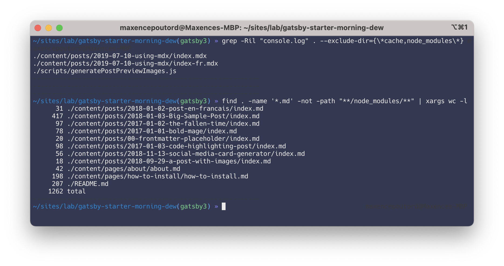
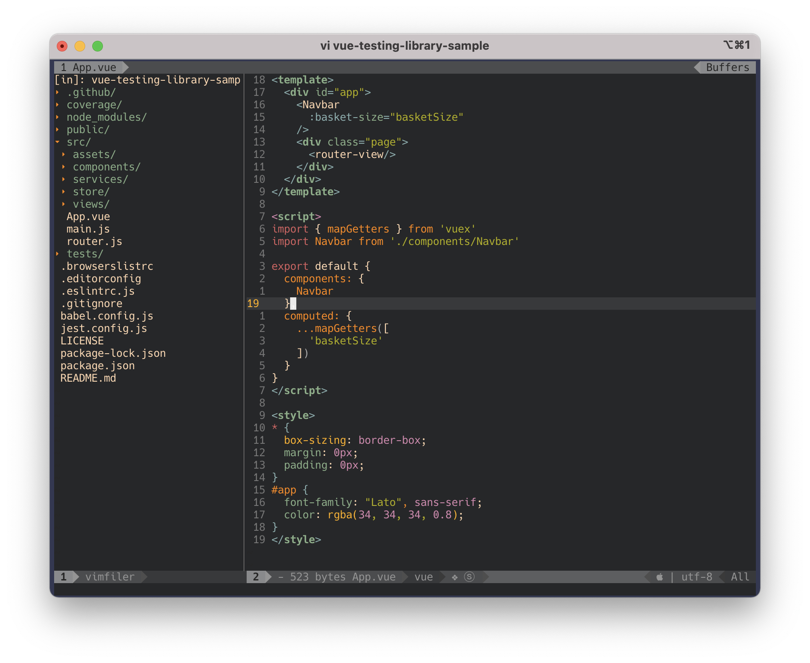
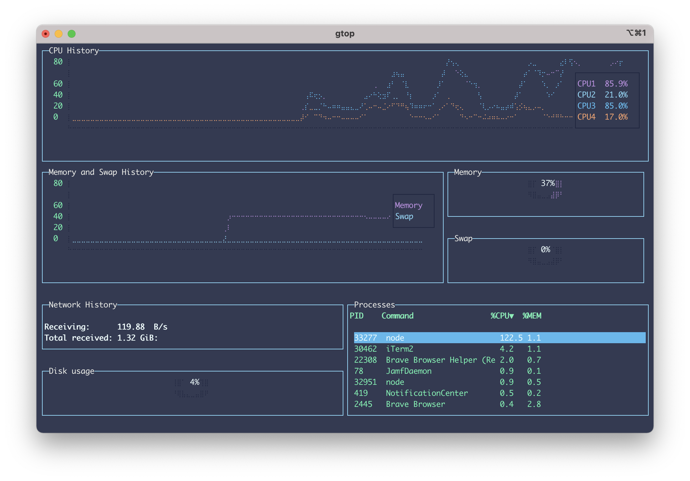

Like many developers, I use the terminal on a daily basis.



I actually use 2 different terminals: the one embedded in VScode and iTerm2 (I'm on macOS). Although
this post contains the word bash, I don't use it directly. I use zsh with
[ohmyzsh](https://ohmyz.sh). If you never heard about it before, it supercharges bash and adds more
interactivity. It also gives me interesting feedbacks like the branch and working directory I am
currently in.

By the way, if you like the theme I'm using, feel free to steal
[my dotfiles](https://github.com/maxpou/dotfiles). Also, I won't be covering the Git part as I
already did in [this blog post](/git-cheat-sheet).

## Cheatsheet

### How many ".js" files does this folder contains?

```bash
find . -name "*.js" | wc -l

# You can also exclude a folder (i.e. node_modules)
find . -name "*.js" -not -path "**/node_modules/**" | wc -l
```

### How many lines of code in this folder?

```bash
find . -name '*.vue' | xargs wc -l

# You can also exclude a folder (i.e. node_modules)
find . -name '*.vue' -not -path "**/node_modules/**" | xargs wc -l
```

### Find all occurrences

Example: list where "console.log" is used in the codebase.

```bash
grep -Ril "console.log" .

# You can also exclude folders (i.e. .cache and node_modules)
grep -Ril "console.log" . --exclude-dir={\*cache,node_modules\*}
```

### How big is my folder?

Example: list where "console.log" is used in the codebase.

```bash
du -sh .

# same but excluding git folder
du -sh -I .git .
```

## What about Vim?



I mostly use Vim for Git commits. It can also be handy when your IDE struggle to open 10 0000 lines
long files. To _pimp my vim™_, I installed something called [SpaceVim](https://spacevim.org). It
adds fancy things like a file explorer and the syntax color.

## Aliases

### Everything verbose!

Since you're there, I aliased all my filesystem commands to make them more verbose.

```bash
# mv, rm, cp
alias mv='mv -v'
alias rm='rm -v'
alias cp='cp -v'
```

### RAM consumption

```bash
alias ram='ps aux | awk '"'"'{print $6/1024 " MB\t\t" $11}'"'"' | sort -rn | head -25'


# Usage
$ ram
507.039 MB              /usr/local/bin/node
461.391 MB              /Applications/Brave
358.879 MB              /Applications/Visual
...
```

### 🏴‍☠️ Change your mac address

This one is not really tech-related. I mostly use this one in airports/coffee shops to renew mac
address (and get illimited access).

```bash
function airport() {
  local mac=$(openssl rand -hex 6 | sed 's/\(..\)/\1:/g; s/.$//')
  sudo ifconfig en0 ether $mac
  sudo ifconfig en0 down
  sudo ifconfig en0 up
  echo "Your new physical address is $mac"
}
```

### 🙃 The Russian Roulette

```bash
alias russian-roulette='
  [ $(( $RANDOM % 6 )) == 0 ] && rm -rf / || echo "You live"'
```

_If you like to live on the edge... but please, be smart! And don't run commands you don't know the
effects of!_

## Bonus #1: Tree

I use [tree](https://formulae.brew.sh/formula/tree) to display directories as trees. It very cool to
write documentation.

```bash
$ tree content/pages

├── components
│   ├── button.js
│   └── checkbox.jpg
├── pages
│   ├── about.js
│   └── dashboard.js
├── index.js
└── README.md
```

## Bonus #2: Gtop

[Gtop](https://github.com/aksakalli/gtop) is a system monitoring dashboard. Typing Gtop on my
keyboard is usually quicker than opening the activity monitor (for some unknown reasons I always
struggle to find it).



## Bonus #3: cloc

If you have npm and npx installed you can use cloc like this:

```bash
$  npx cloc src content gatsby-*

------------------------------------------------------------
Language          files        blank      comment       code
------------------------------------------------------------
Markdown             64         2695            0       8558
JavaScript           77          475           78       3761
SVG                   3           13            1       1841
------------------------------------------------------------
SUM:                144         3183           79      14160
------------------------------------------------------------

# You can also check a subset of files like this
$ npx cloc src --match-f='.test.js'
```
