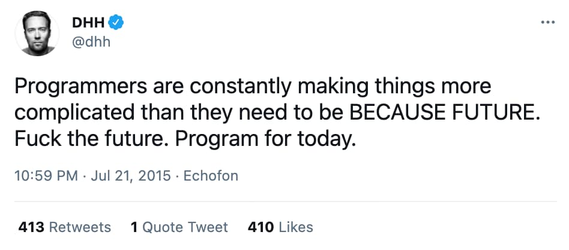
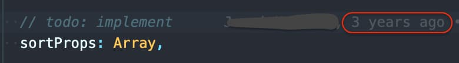
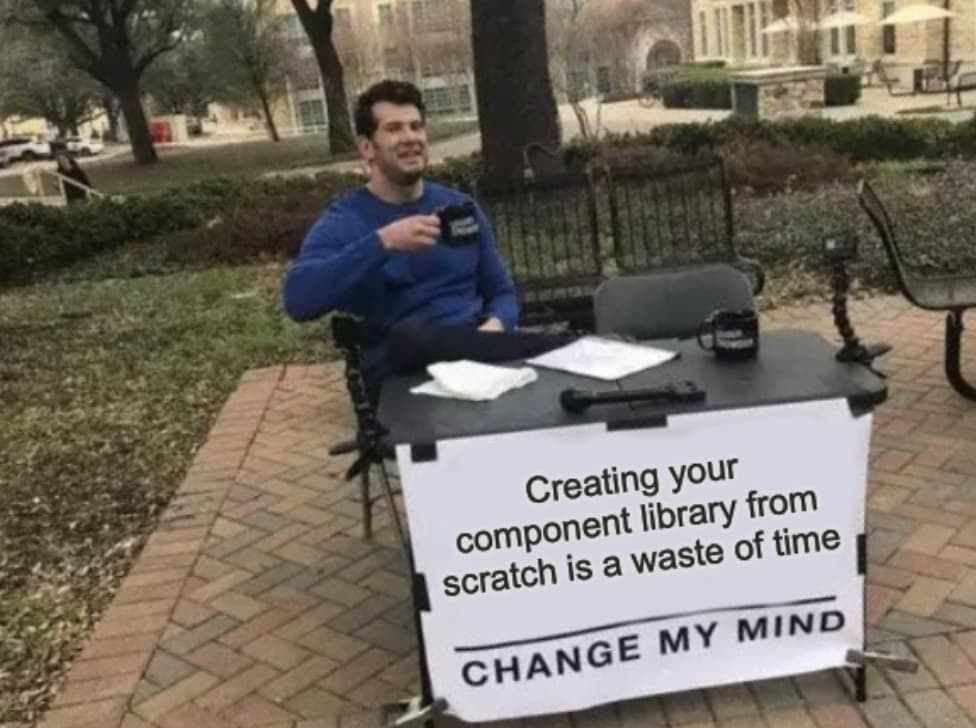

I've been maintaining a massive Vue.js codebase for the last 3 years. Here are 9 lessons I've
learned along the way. Not really mistakes I've made but most likely things I'd do differently
today.

> TL;DR:
>
> - [No standards, no consistency](#no-standards-no-consistency)
> - [Close the door on bikeshedding](#close-the-door-on-bikeshedding)
> - [Respect your elders](#respect-your-elders)
> - ["F\*\*\* the future. Program for today."](#f-the-future-program-for-today)
> - [Dependencies: we should have been stricter](#dependencies-we-should-have-been-stricter)
> - [Don't use TODOs](#-todo-refactor)
> - [Keep your audits](#keep-your-audits)
> - [Mimic your users](#mimic-your-users)
> - [Don't create your core components from scratch!](#dont-create-your-core-components-from-scratch)

## No standards, no consistency

I don't think it's possible to have **consistency** without any communication. If your app is
organised in 3 different feature teams you don't want to have 3 different ways of doing one thing.
Agree on standards then communicate. Communication is the key.

Don't be afraid to repeat yourself: _"pedagogy is the art of repeating yourself"_.

## Close the door on bikeshedding

It starts by linting your code. No one likes comments like "you forgot a semicolon" on pull
requests. Find a set of rules and follow it. Blindly. If you start to discuss it, you open a door
for bikeshedding.

I also recommend you to write a "Pull request: do and don't" so everybody knows what is and what's
not expected.

## Respect your elders

Working with legacy can be frustrating. But it's not a reason to finger-point your elders. Try to
find the root cause (i.e. code was written by Backend, there was no communication at that time...).
Migrating towards greener pastures is a slow process. If there's no plan to get rid of the debt,
it's time to make one.

## "F\*\*\* the future. Program for today."

We've made a lot of big technical decisions based on FUTURE. Guess what? Years after this future
never happened. I don't have a crystal ball so I can't tell what the future will look like. If it's
the same for you, don't make big decisions based on dreams and hopes.

Program for today!

## Dependencies: we should have been stricter

  
_Me opening the package.json_

Every time I open the package.json file, I keep thinking the same thing: _"we should have been
stricter"_. We have a list of 95 dependencies and 90 dev-dependencies.

Why?

I think the **fear of being a gate blocker** played a big part. A second factor was probably letting
the pull request merge without approval from a frontend developer. Having many dependencies increase
the risk of having a malicious package. Also, if we want to change the Vue.js version, we have to
ensure that each library support it.

## `// TODO: refactor`

**TODOs are the graveyard of important but not urgent tasks.** The "I will fix it later" strategy
doesn't work. If you're not very proud of the code you wrote, it's fine. It happens to the best of
us ;) But please don't pollute the code with a TODO.

## Keep your audits

We have made a lot of progress in terms of performances, accessibility, and code quality. In 3
years, I've made tons of audits with tools like Google Lighthouse or Axe. But I never kept a single
one. It's such a pity because if today someone asks me what the progress we've made over the last 6
months, I can't give any numbers.

By the way, it can also provide some metrics for your CV ;)

## Mimic your users

If you work on your app locally, with a 1500€ laptop and a fiber-optic internet connection, you will
never experience a performance issue.

I can say the same thing if you're using a large screen. 2.5y ago, I went fully remote and I dropped
my fancy 26" curved screen. I realized that a few pages or our app were not readable on a 13".

## Don't create your core components from scratch!

We started building our component system ~2.5y ago. A lot of components we created ended up being
surprisingly complex. When we couldn't refactor them, we created a new one (and deprecated the
other).  
Today, we have ~30 deprecated components and some of them are used a hundred times.

Looking backwards, we wasted so much time creating the components (from scratch), testing, making
them accessible (a11y) and writing the documentation. If we started with an existing one, we could
have spent more time focusing on the business or the architectural part.

No one cares if the button component you're using doesn't have "the perfect border-radius"!
