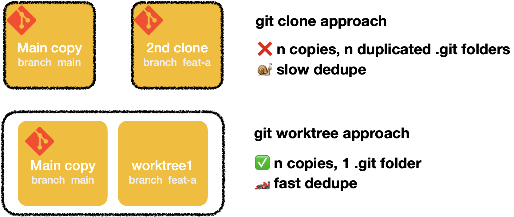

A few months ago, I had to do a fix that requires both backend and frontend. I branch off from my
backend colleague branch... In the end, keeping my branch up to date with the `main` branch plus my
colleague's branch ended up being a bit messy (I rebase a lot and my colleagues didn't).

I googled something like _"how to have multiple git branches at the same time"_. In one
StackOverflow post, someone mentioned git worktrees. Something I never heard before!

## Git worktrees to the rescue!

`git worktrees` allows you to attach a branch to a specific folder. It's like doing a clone of a
repository that shares the same git folder.



Using worktrees also makes the context switching easier. Before that, I used 2 different strategies
for context switching:

- Git clone a new repository. Pulling the `.git` folder makes this approach slow. Plus you can't
  cherry-pick commits between 2 different clones.
- Create a wip commit on your actual branch or the plain old [git stash](/git-cheat-sheet#stash). It
  does the job but it can be tedious when your actual branch has too many different dependencies.
  The git stashes can also be subjects to git conflicts.

## How worktree works?

Let's say I want to move this blog from Gatsby to Nextjs. But I want to keep a copy in case I found
a typo somewhere. Using Git worktrees would be the perfect fit.

To create a worktree:

```bash
$ git worktree add ../nextjs-migration
```

If I list my worktree, here's what I have:

```bash
$ git worktree list
/Users/maxence/lab/maxpou.fr         be8e2774 [main]
/Users/maxence/lab/nextjs-migration  be8e2774 [nextjs-migration]
```

We now have 2 folders: "maxpou.fr" (on branch main) and "nextjs-migration" (on branch
nextjs-migration).

As I mentioned earlier, these 2 different folders share the same `.git` folder and history. If we
check the new folder, it doesn't contain a .git folder but a .git file, which only contains this
line:

```
gitdir: /Users/maxence/lab/maxpou.fr/.git/worktrees/nextjs-migration
```

Now, let's forget about this nextjs thing. To delete this worktree (folder+branch), run the
following:

```bash
git worktree remove nextjs-migration
```

That's it! 🥳

## Good use case

I've been using this feature for the last 3 months. Here's a few use case:

- consequent migrations: I've been migrating big migrations to our codebase (changing major npm
  version and module bundler). Both of these migrations happened in a different worktree.
- keeping a local version of a specific environment
- checking a colleague PR locally (when I don't want to git stash or create a wip commit)

**💡 NPM Tips:** `npm install` can sometimes be slow. If you only want to install dependencies
without doing any optimizations, I recommend you to install your dependencies with `npm ci` (stands
for clean install). It's much faster!
