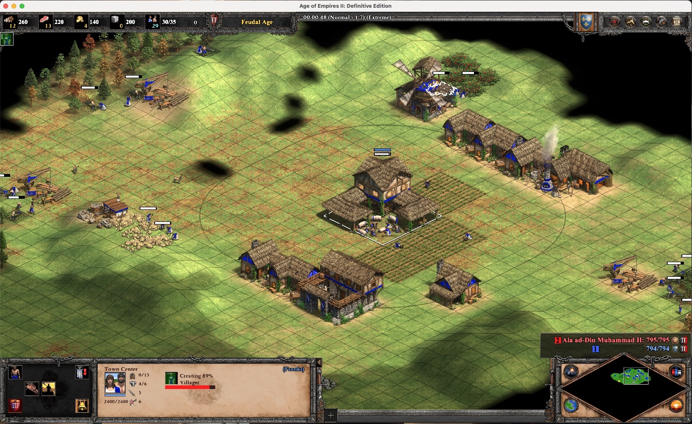

import Warning from '../../../../components/MDX/Warning.astro'

Age of Empire 2 est de loin mon jeu préféré. J'y joue depuis que je suis tout petit et maintenant,
depuis la sortie de la Definitive Edition, j'ai recommencé à y jouer. Je joue sur Mac (modèle M1
Pro) et on me demande souvent comment je fais. Voici donc un petit guide.

Gardez à l'esprit que cette configuration est destinée aux puces Silicon (M1, M1 max, M2 etc.). Si
vous possédez un processeur Intel, je vous recommande d'utiliser
[Boot Camp](https://support.apple.com/en-us/HT201468).

## Option 1 - Crossover

J'utilise Crossover (payant).

1. Installez [Crossover](https://www.codeweavers.com/crossover#mac) - Vous pouvez facilement trouver
   des coupons de reduction en ligne ou commencer par l'essai gratuit.
2. Sur Crossover, cliquez sur "+ Install" et installez une bottle "Steam".
   - Verifiez que c'est bien un Windows 10/64 bits.
   - Dans les paramètres de la bouteille, assurez-vous que "DXVK" est activé.
3. Lancez Steam, connectez-vous et installez le jeu
4. Téléchargez
   "[ucrtbase.dll](https://community.pcgamingwiki.com/files/file/2081-ucrtbasedll-extracted-from-microsoft-visual-c-2015-redistributable-update-3-rc/)"
5. Sur la bouteille Steam, faites un clic droit > Ouvrir le lecteur C: et placez la DLL sur
   `C:/Windows/System32` (il faut remplacer la DLL existante).
6. Lancez le jeu et amusez-vous ;)

<Warning title="Heads-up!">
  Le jeu ne fonctionne pas avec Crossover v22. Pensez à bien utiliser la version 23
  ([details](https://www.codeweavers.com/compatibility/crossover/forum/age-of-empires-ii-definitive-edition?;msg=278919#c35)).
</Warning>

## Option 2 - GeForce NOW

GeForce NOW est la plateforme de cloud gaming de Nvidia. Techniquement, le jeu ne fonctionnera pas
sur votre Mac mais sur une machine distante. Avec une bonne connexion internet, vous le remarquerez
à peine. Les étapes pour lancer le jeu est assez simples :

1. [Téléchargez GFN pour Mac OS](https://www.nvidia.com/en-us/geforce-now/download/)
2. Créez un compte GFN, connectez votre compte Steam.
3. Sélectionnez le jeu et cliquez sur "Play".

J'ai essayé, avec mon compte (sur un forfait freemium on peut jouer jusqu'à 1h/jour). J'ai été
agréablement surpris de voir que tous mes raccourcis clavier, mods et paramètres de jeu étaient déjà
là.

Bien que le jeu soit très fluide, les graphismes ne sont pas optimaux (peut-être que la version
payante améliore le rendu).

## Raccourcis clavier

Avant de commencer, gardez à l'esprit que les raccourcis clavier sont personnels. J'ai étendu les
raccourcis clavier par défaut pour qu'ils correspondent à mes préférences. Notez aussi que j'utilise
un clavier international _(qwerty)_.

Voici ce que j'ai :

Je suis une logique suivante : si `A` c'est la touche de ma caserne, alors `ctrl + A` correspond à
"Aller à la caserne" et `maj + A` correspond à "Sélectionner toutes les casernes".

Pour faire des "quick walls", j'utilise les touches `Q` et `Y` qui sont aussi associées à la
commande "construction du villageois".

J'utilise les boutons de ma souris pour :

- Molette + haut / bas - Prochaine unité militaire inactive / Arrêt de l'unité. (J'utilise aussi la
  molette pour les faire tourner les portes)
- Bouton supplémentaire 1 - Sélectionner tous les TC
- Bouton supplémentaire 2 - Allez voir le prochain villageois inactif
- Bouton supplémentaire 3 - Aller à la dernière notification (ou P)

Votre fichier de raccourcis sera disponible ici:
`/Users/{MACOS_USER}/Library/Application Support/CrossOver/Bottles/Steam/drive_c/users/crossover/Games/Age of Empires 2 DE/{YOUR_STEAM_ID}/`

## Mods

Encore une fois, c'est aussi quelque chose de très personnel. Mais voici les mods que j'utilise :

- Advanced Idle Pointer
- No more plants
- Short walls
- Anne_HK - New Fish Border
- Anne_HK - Better Resource Panel and Idle Villager Icon
- Anne_HK - Bigger and Eye-catching Relic
- Anne_HK - Selected Small Trees with Grid Shadow
