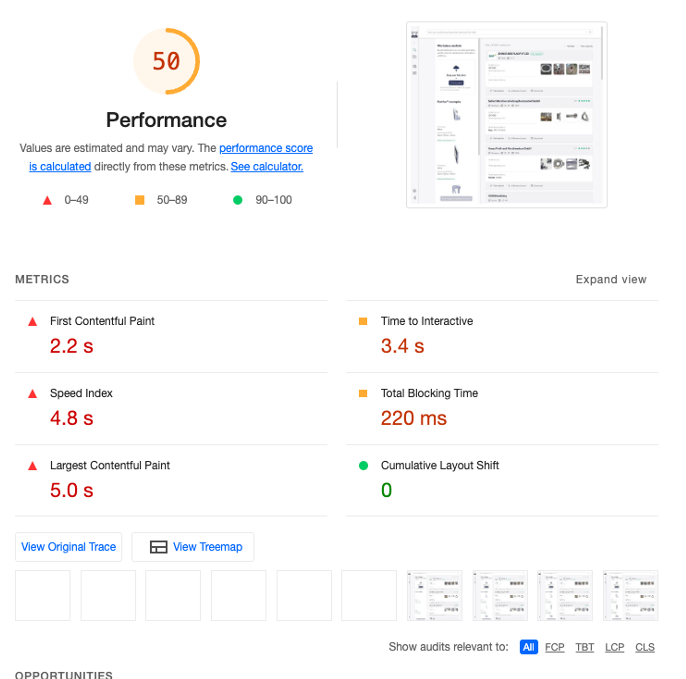
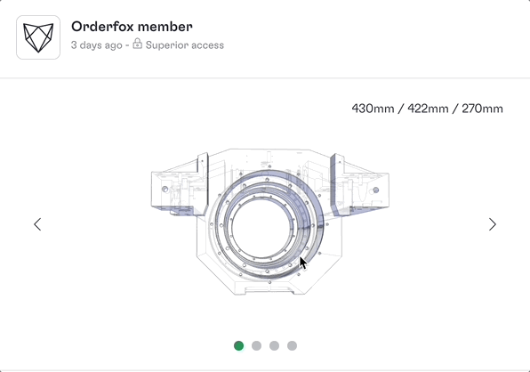
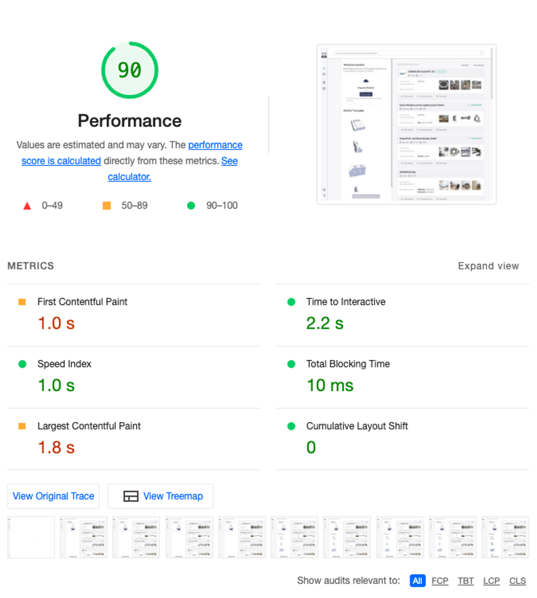

import Info from '../../../../components/MDX/Info.astro'
import Warning from '../../../../components/MDX/Warning.astro'

The application I’m working on recently had a significant change: we decided to go from something
wholly closed (behind a connection wall) to something more open. Which means, searchable on the
internet.

<Info title='💡 A side note about the application'>

[Partfox](https://ui.orderfox.com/search) is a search engine that facilitates connexions between
manufacturers and buyers in the CNC industry. In a nutshell, the user can post a technical drawing
on the platform and we show them manufacturers that could make their workpiece.

Technically it’s a single-page application built with React, TypeScript, and Vite. It’s hosted on
Heroku.

</Info>

Two big topics came to the top of my priorities: SEO and Web Performance.

As per usual, I started with a Google Lighthouse audit. The result was far from great.



<Info>
  💡 **Tips:** when you do an audit with Lighthouse, always use your browser in incognito mode! In
  normal mode, your AdBlockers automatically block 3rd party libraries, which makes the website load
  faster.
</Info>

With the help of Google and Lighthouse, I ended up with a large to-do list.

## Step 1: lazy loading images

By default, images in the browser load immediately. It can lead to a bottleneck when you try to
print many images on one page. To prevent this, you can change this default attribute and
[lazy load](https://developer.mozilla.org/en-US/docs/Web/HTML/Element/img#loading) images.

```jsx
// Before


// After

```

In a nutshell, you can defer the image loading. When your screen is about to see the image, it loads
it automatically.

<iframe
  width="560"
  height="315"
  src="https://www.youtube.com/embed/TP24UeofpMY"
  frameborder="0"
  allowfullscreen
></iframe>

<Warning title="This is not a silver bullet">
  Having too much lazy loading on your page can negatively impact your performance ([see
  why](https://web.dev/lcp-lazy-loading)).
</Warning>

## Step 2: using an image CDN

Most of our assets (images, pdf, video) are hosted on a S3 bucket. When your app directly points to
a S3 bucket you have zero compression, no image optimisation and it uses HTTP 1.1.

Using an image CDN addresses these issues. We picked Cloudinary which is a paid product. We decided
to go for this tool for a simple reason: it’s easy to use.

```jsx
// before
https://s3-bucket.com/image.jpg

// after
https://res.cloudinary.com/{CLOUDINARY_ID}/image/fetch/w_80,h_80,c_thumb/https://s3-bucket.com/image.jpg
```

The 2nd URL will return a thumbnail of 80x80px of the original link. It’s automatically served with
http/2 and the HTTP response has the right headers (for caching).

## Step 3: code splitting (with react-router)

{/* https://orderfox.slack.com/archives/C01E7P2ACCV/p1647428702147079?thread_ts=1647428373.269069&cid=C01E7P2ACCV */}

For routing, we use React Router for linking routes with components. Our routing system was similar
to this one:

```jsx
// Before
import { createBrowserRouter } from 'react-router-dom'
import SearchLanding from '@/modules/search/SearchLanding'
import ResetPassword from '@/modules/account/ResetPassword'

export const router = createBrowserRouter([
  {
    path: '/',
    element: <App />,
    children: [
      {
        path: 'search',
        element: <SearchLanding />,
      },
      {
        path: 'reset-password',
        element: <ResetPassword />,
      },
      // ...
    ],
  },
])
```

This generates a big JS file with the entire application. It’s a pity to load the entire application
when you only want to see one page.

Fortunately, this problem can be addressed with React Suspense.

```jsx
// After
import { lazy, Suspense } from 'react'
import Loader from '@/modules/common/Loader'

const SearchLanding = lazy(() => import('@/modules/search/SearchLanding'))
const ResetPassword = lazy(() => import('@/modules/account/ResetPassword'))

export const router = createBrowserRouter([
  {
    path: '/',
    element: <App />,
    children: [
      {
        path: 'search',
        element: (
          <Suspense fallback={<Loader />}>
            <SearchLanding />
          </Suspense>
        ),
      },
      {
        path: 'reset-password',
        element: (
          <Suspense fallback={<Loader />}>
            <ResetPassword />
          </Suspense>
        ),
      },
      // ...
    ],
  },
])
```

With this, the application will be bundled into many files. So _“the user only loads what is
needed”_. When the user goes from one page to another, he will see the loader while the component is
being loaded.

## Step 4: Using a CDN for HTTP/2

In the previous step, I show you how we went from 1 big JS file to many files (~80). But, loading
what you already need can be very costly. Mostly when you’re only using HTTP/1.1. This protocol only
allows downloading one file at a time.

One of the biggest additions of HTTP/2 (h2) is the
“[Request and response multiplexing](https://web.dev/performance-http2/#request-and-response-multiplexing)”.
When it came out, it was like a revolution in the browser. It allows the browser to download
multiple files with a single request. Because “a picture is worth a thousand words”,
[here’s a cool animation](https://freecontent.manning.com/animation-http-1-1-vs-http-2-vs-http-2-with-push/)
if you want to better understand why h2 is faster.

Our application was running on a Heroku dyno. Unfortunately, they do not support h2 (at the time
being). To get it, while keeping our Heroku infrastructure, the solution is to use a CDN. CloudFront
(AWS product) was the most relevant pick for us because we already had a few tools using the AWS
suite. Same as our image CDN, CloudFront gives us a bunch of good additions such as h2, optimised
caching… But it’s a hell of a mess to configure.

## Step 5: lazy load big components

Our coolest component is also the worst in terms of performance. When a user uploads a technical
drawing, we render it in 3D. Under the hood, it uses a bunch of three.js libraries which render HTML
canvas. The component itself weighs ~2Mb (thanks Three.js!).



Unfortunately for us, these technical drawings can also be cumbersome. The file needed to display
the canvas ranges from 1 to ~12MB. On our feed page, we can display a lot of them.

I ended up with a solution mixing React.suspense and a custom hook:

- React.suspense - to defer loading the JS assets needed to show the component.
- A [`useIsVisibleOnScreen` hook](https://gist.github.com/maxpou/f235ef5b2e0f63b3a32e78f484b081c8) -
  to defer loading the assets needed to show the 3D piece. In a nutshell, this hook detects if the
  component is in the viewport or if he is about to be seen.

## Outcome

…after I these changes, I did another bunch of audits and tada! I finally got a more decent score 🎉



I know what you think: it could be 100.

But, this is not a side project, nor a “Hello World” project. Focusing on the last 10 remaining
points would be too time-consuming for me. It’s not worth the trouble.

What I liked about this journey was the simplicity of the actions to obtain a decent performance
score. I mean, it’s not rocket science. I mostly followed tips given by Lighthouse and other best
practices that can easily be found on the internet.
