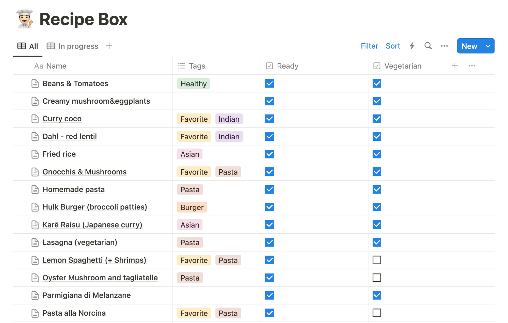
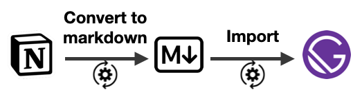
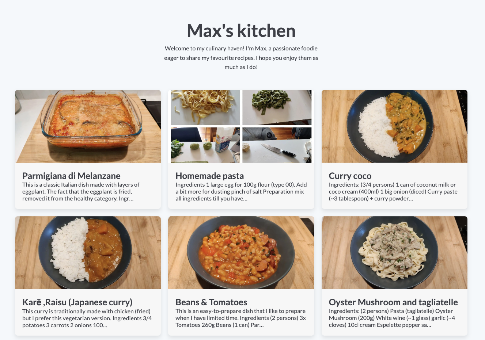

import Warning from '../../../../components/MDX/Warning.astro'

When I post on my blog, I write the content in markdown and Gatsby.js do some magic and converts
everything to HTML. I had some cooking recipes on my Notion workspace and I recently wanted to
publish them online.

Since I wanted to keep Notion as my source of truth, I had to find a way to publish them
differently.



By the way, I titled this post mentioning Gatsby.js. But, if you use a different static site
generator (like Astro or Next.js).

## Big picture



I have one JS script that does different things in 2 steps:

1. Get all database pages (with the filter “ready”). And convert them to a markdown (or MDX) file.
2. Gatsby makes HTML content out of the markdown.

<Warning title="About the images">
  The images retrieved from the Notion API are only available for 1h
  (https://developers.notion.com/reference/file-object#notion-hosted-files). You must host them on
  your side if you don’t want to rebuild your website every hour.
</Warning>

## Step #1: From Notion to Markdown

I wrote a NodeJS script that uses 2 libraries:

- `@notionhq/client` to query the pages of my database.
- `notion-to-md` to convert the pages to markdown.

```jsx title="scripts/notion-to-markdown.js"
const fs = require('fs')
var http = require('https')
const { Client } = require('@notionhq/client')
const { NotionToMarkdown } = require('notion-to-md')

const notion = new Client({ auth: 'your-secret-id' })
const DB_ID = 'your-db-id'

const n2m = new NotionToMarkdown({ notionClient: notion })

// Get all pages in the database
async function getPages() {
  const pages = await notion.databases.query({
    database_id: DB_ID,
    filter: {
      property: 'Ready',
      checkbox: {
        equals: true,
      },
    },
  })
  return pages.results
}

const getBlocks = async blockId => {
  const response = await notion.blocks.children.list({
    block_id: blockId,
    page_size: 50,
  })
  return response.results
}

const download = (url, destination) => {
  const fileStream = fs.createWriteStream(destination)
  http.get(url, function (response) {
    response.pipe(fileStream)
    console.log('👨‍🍳 File downloaded', destination)
  })
}

;(async () => {
  fs.rmdirSync('./content/recipes', { recursive: true })
  fs.mkdirSync('./content/recipes')
  fs.mkdirSync('./content/recipes/assets')
  const pages = await getPages()

  for (const page of pages) {
    const fileName = page.url.replace('https://www.notion.so/', '')
    const title = page.properties.Name.title.map(t => t.plain_text).join()
    const blocks = await getBlocks(page.id)
    let olCounter = 1

    const cleanBlocks = blocks.map((block, i) => {
      if (block.type === 'image') {
        const imgFileName = `${fileName}-${i}.jpg`
        const destination = './content/recipes/assets/' + imgFileName
        download(block.image.file.url, destination)
        block.image.file.url = './assets/' + imgFileName
      } else if (block.type === 'numbered_list_item') {
        olCounter = blocks[i - 1]?.type === 'numbered_list_item' ? olCounter + 1 : 1
        block.numbered_list_item.number = olCounter
      }
      return block
    })

    const mdblocks = await n2m.blocksToMarkdown(cleanBlocks)
    const mdString = n2m.toMarkdownString(mdblocks).parent
    const coverFileName = `${fileName}-cover.jpg`
    page.cover && download(page.cover.file.url, './content/recipes/assets/' + coverFileName)

    const header = `---
title: ${title}
date: ${page.created_time}
slug: ${fileName}
${page.cover ? `cover: ./assets/${coverFileName}` : ''}
---
    `
    const fileContent = header + mdString

    fs.writeFile(`./content/recipes/${fileName}.mdx`, fileContent, () => {
      console.log(`👨‍🍳 File downloaded: ${fileName}`)
    })
  }
})()
```

Heads-up!

- To run the script, run `node scripts/notion-to-markdown.js` on your terminal.
- I had to handle the `numbered_list_item` manually _(see the `olCounter` variable)_. The
  `notion-to-md` library currently has an issue with the ordered lists.

After running the script, my folder looks like the following:

```sh
content/
├── posts # all my blog posts
└── recipes
    ├── [recipe-1-slug].mdx
    ├── [recipe-2-slug].mdx
    ├── ...
    └── assets
        ├── [recipe-1-slug]-cover.jpg
        ├── [recipe-1-slug]-0.jpg
        ├── [recipe-2-slug]-cover.jpg
        ├── [recipe-2-slug]-0.jpg
        └── ...
```

## Step #2 - Gatsby.js

Dealing with Markdown is a thing that Gatsby does well. If you’re unfamiliar with it, I recommend
you look at their
[Getting Started guides](https://www.gatsbyjs.com/docs/how-to/routing/adding-markdown-pages/).

After some CSS fine-tuning, I ended up with something like that 🥳

If you want to check it out, the project is available [here](https://maxpou.fr/recipes). By the way,
my website’s [GitHub repository](https://github.com/maxpou/maxpou.fr) is public!



## What could be improved?

### Deployment

If I change a typo in Notion, to see the fix live on my website, I need to run the command and then
git commit&push the change.

### Limited block support

At the moment I only support basic notion items. Things such as linking pages together, videos or
uploaded files are not supported.

Also, I didn’t find a way to write MDX (Markdown+JSX)

### Import everything or nothing

My `notion-to-markdown.js` script gathers all the posts and all the images at once. It’s ok for now
because I don’t have thousands of items in Notion. Otherwise, I’d probably have to add a new filter
in the `notion.databases.query()` function!
