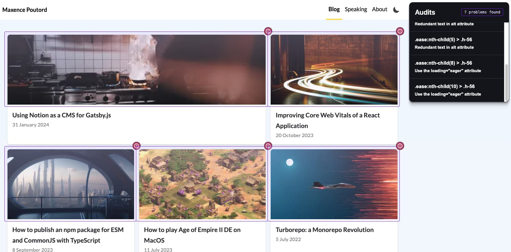
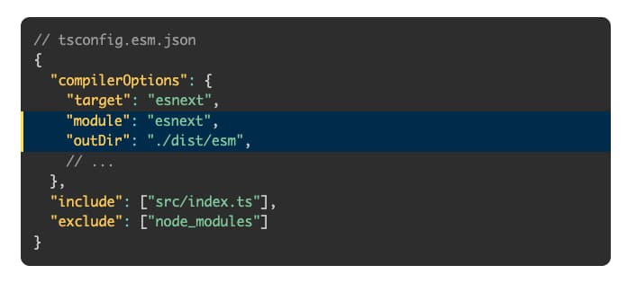
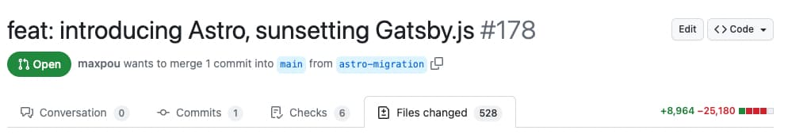

I've been (inconsistently) blogging for ~10 years. It all started with a PHP/MySQL stack when I was
a student. Then I quickly move away from it to use Jekyll, a static site generator written in Ruby.

Around 5 years ago, I decided to move [from Jekyll to Gatsby.js](../hello-gatsby). At that time I
wasn't 100% happy with the existing starters, so I decided to create one and build my blog on top of
it. [gatsby-starter-morning-dew](https://github.com/maxpou/gatsby-starter-morning-dew) was born. It
slowly became one of my most stared open source projects on GitHub.

## My problems with Gatsby.js

Recently my motivation to write articles has faded. Every time I start my website locally, writing
posts. I came with the same problems:

- **GraphQL**. It's cool, it's fun… but let's be honest: it's overkill for a simple blog.
- **Speed**: generating all the HTML can be slow. Even locally. At work, I've installed vite.js and
  my project starts in less than a second. When your side project
- **Release cycle**: they release very often. Over the last few years, I spent more time updating my
  packages than writing content. _(yeah I know, I only wrote 3 posts last year…)_
- **Dependency management**: I got some OCD when it comes to npm packages and, with Gatsby,
  everything has a package. I ended up with 35 packages… to convert Markdown into HTML.

Don't get me wrong. I don't want you to think that Gatsby is washed up. I still consider it a great
tool but, you know **I'm just a kid that sometimes needs a new toy to play with**.

## 👋 Hello Astro!

I was first thinking about going with Next.js. But, last year when I checked it it wasn't for me.
And then I saw a post from [Loige](https://loige.co/) on Twitter saying that he was moving his blog
to Astro. I was also trying to find something to do for my 3-hour trip train the next day.

I decided to give Astro a go and started with this official starter:

```bash
npm create astro@latest -- --template blog
```

I also took some time to read about the
[**concept of Islands**](https://docs.astro.build/en/concepts/islands/). This is essential to
understand how your Astro app works and why it makes it load fast.

## First impression

It uses TypeScript and… Vite.js 😍

I moved one post to the “content” folder. 10 minutes later, after changing some parameter names, I
was able to see my post in the default template! Another good news: they use [Zod](https://zod.dev/)
for type checking.

Astro URLs are quite straightforward. If you have an Astro component in `src/pages/about.astro`, it
will be available in `website.com/about` . You can also pass some variables in your file name to
match multiple scenarios (i.e. `src/pages/blog/[slug].astro`).

If you've worked with React and JSX before, the `.astro` format will look familiar.

```astro title="pages/index.astro"
---
import { getCollection } from 'astro:content'
import { SITE_AUTHOR } from '../../consts'
import FormattedDate from '../../components/FormattedDate.astro'

const posts = await getCollection('blog')
---

<div>
  <h1>My blog</h1>

  <section>
    {
      posts.map(post => (
        <div>
          <a href={`/blog/${post.slug}/`}>
            
            <span>{post.data.title}</span>
            <span>Written by {SITE_AUTHOR}</span>
            <FormattedDate date={post.data.pubDate} />
          </a>
        </div>
      ))
    }
  </section>
</div>
```

I highly recommend you use an IDE plugin to get a proper syntax colour and a better TypeScript
support.

## Go/no-go?

At the end of my 3h trip, I had:

- +90% of my blog posts and pages migrated;
- All MDX components migrated (with some TailwindCSS).

Overall, the transition felt very smooth. The developer experience feels great and the Astro
documentation is overall well written.

I left the train very happy about my work. This POC was a success and I decided to continue the
migration 🥳

## The Migration

When the POC was a success, I made a plain old to-do list.

- **Blog posts & pages.** Surprisingly my ~60 posts and pages weren't that complicated to migrate.
- **Dark mode.** My previous dark mode implementation was ~~based~~ a copy-pasted from
  [Josh Comeau's post](https://www.joshwcomeau.com/react/dark-mode/). Now it's handled with
  Tailwind. And the toggle button state is handled with preact. A cool thing with Astro is they
  allow you to work with the framework of your choice.
- **Pagination**. This part gave me some headaches. I'm glad I could steal the pagination code
  Loige's wrote!
- **i18n posts**: this blog started in French and now it's mostly in English. I no longer have
  react-helmet (a library to write in the HTML head element). I had to create a Layout component and
  pass the data with “prop drilling”.
- **SEO**: by default,
  [the blog starter](https://github.com/withastro/astro/tree/main/examples/blog) is SEO-friendly
  (canonical URLs, OG data, sitemap support).
- **CV.** I decided to make [my resume](https://www.maxpou.fr/cv/) available online and printable
  (with some CSS shenanigans). Switching to Tailwind was very time-consuming.
- **Webmentions**: My previous website used to have [webmentions](https://indieweb.org/Webmention).
  Since my activities on social platforms are quite low, I put this on the "nice to have / later"
  section of my to-do list.
- **The astro toolbar.** this is an out-of-the-box tool which audits your page and gives you some
  accessibility or performance improvement tips. I've found it very handy!
  

To be honest, the biggest work was transitioning from styled-components to Tailwindcss.

## Some pain points

### It looks like JSX, but it's not!

It's impossible to pass objects (therefore functions) to the HTML part. To do so you have to use the
plain old `getElementById`.

```astro del={1-8} ins={10-16}
---
function handleClick() {
  console.log('button clicked!')
}
---

<!-- ❌ This doesn't work! ❌ -->
<button onClick="{handleClick}">Click me!</button>

<button id="myBtn">Click Me</button>
<script>
  function handleClick() {
    console.log('button clicked!')
  }
  document.getElementById('myBtn').addEventListener('click', handleClick)
</script>
```

Also, when you have a loop (i.e. .map()), there's no need to add a key attribute… because it's not
JSX ;)

### Default code syntax plugin

In my posts, I like to highlight some lines of code like this:



Unfortunately the default plugins available can't do that. I had to use an
[external package (expressive-code)](https://expressive-code.com/installation/) for that.

### Pagination

Because of Astro's structure, when you want to have `site.com/blog` and `site.com/pages/2` You have
to write 2 components. One for the page 1 and one for the pages ≥2.

```bash
src/pages
├── blog
│   ├── [slug].astro      # Post wrapper component
│   ├── index.astro       # List wrapper component (for page n°1)
│   └── pages
│       └── [page].astro  # List wrapper component (for pages > 1)
```

### Prose

[Prose](https://docs.astro.build/en/recipes/tailwind-rendered-markdown/) is the Tailwind element
used to style something you cannot control. Here the uncontrolled element is the Markdown content.
For an unknown reason, I have a love-hate relationship with it. On the one hand, it's super cool to
have this helper… but, it can also be tedious to work with. Mostly when you combine element state
(like `hover:`) with app state (like `dark:`). In some cases, I had to use a specific order to chain
them.

### 1 component per file

I was previously working with styled-components. This lib is fantastic when you want to create
multiple small components in 1 file.

```jsx
// Common.js
export const Text = styled.p`
  line-height: 1.6;
  margin: 1em 0 0 0;
`

export const Bull = styled.span`
  display: inline-block;
  color: var(--color-textSecondary);
  margin: 0 4px;
  &::before {
    content: '•';
  }
`
```

In Astro, it's 1 file per component. And since I wanted to use Tailwind, I had to use their
[nasty hack](https://tailwindcss.com/docs/reusing-styles) which I don't like.

---

…And that's it! Seriously, I thought it would be harder!

In the end, my pull request looked like this:



## Final thoughts

I'm happy with the v3 of my website. I no longer have code that I don't understand. Also, Astro is a
tool very fun to play with: it's fast, the learning curve is smooth and it's easy to use.

**Show me the code!**

There you go: https://github.com/maxpou/maxpou.fr
