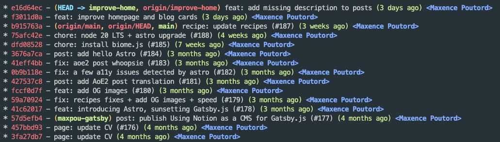
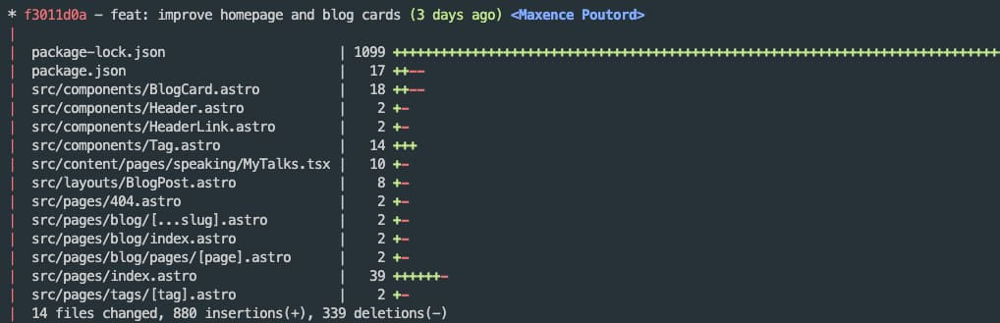

## Overview - How do I use git?

I use the CLI for almost everything except when I want to exclude files from the git add.

I never use the merge command, I always rebase. I prefer to have a cleaner history.

When I open a pull request I always have one unique commit. I update commits with --amend --no-edit
and force push.

Before I start with my config detail, you can see your config with
`git config --list --show-origin --show-scope` (it will also tell you the file location and the
scope).

## Separate work from side projects

```bash
[user]
	email = maxence.poutord@mail.com
	name = Maxence Poutord

# overrides for a specific folder
[includeIf "gitdir:~/code/company/"]
  path = ~/.gitconfig-work

[includeIf "gitdir:~/code/company/"]
  email = maxence.poutord@work.com
```

Having `includeIf` allows you to better separate configs between your company project and your side
projects. You can override with an entire gitconfig file or you can also override a property.

## Sort branch&tags

```bash
[branch]
	sort = -committerdate

[tags]
	sort = -version:refname
```

When you `git branch -a`, everything is alphabetically sorted. With this, they will be ordered by
the last commit date.

When you have gazillions of tags, it’s sometimes better to sort them the other way around. So you
see the latest tags first.

## Auto-cleanup

```bash
[fetch]
	prune = true
```

All `git fetch` will now clean branches that no longer exist on the remote repository.

Note: if you want to do a deep clean you can also run this
`git branch --no-merged | egrep -v "(^\*|main)" | xargs git branch -D` .

## Autocorrect mistyped command

```bash
[help]
	autocorrect = 1
```

This corrects you when you have a typo in your command. If you type `git comit`, git will assume
that you meant ”commit” and run the command 0,1 second after.

## Default branch

```bash
[init]
	defaultBranch = main
```

Set the default branch name to `main` (instead of `master`) for all newly created repositories.

## Editor

```bash
[core]
  editor = vim
```

Change the editor (i.e. for commands like `git commit --amend` and `git rebase`).

💡**Tips:** To use VSCode instead of Vim, replace it with `code --wait`

## Push

```bash
[push]
  autoSetupRemote = true
```

Git automatically sets up a remote tracking branch when you push a new local branch for the first
time.

You will also get rid of messages like _"fatal: The current branch demo has no upstream branch"_.

## Colors

```bash
[color]
  ui = auto
	branch = auto
	diff = auto
	status = auto

[color "status"]
	added = green
	changed = yellow
	untracked = red

[color "branch"]
	current = yellow reverse
	local = yellow
	remote = green

[color "diff"]
	meta = yellow bold
	frag = magenta bold
	old = red
	new = green
```

This is a bit personal but here are the colors I use.

## Bonus - git log on steroids

I use bash aliases instead of git aliases.

```bash
alias glols='git log --graph --pretty='\''%Cred%h%Creset -%C(auto)%d%Creset %s %Cgreen(%cr) %C(bold blue)<%an>%Creset'\'' --stat'
alias glol='git log --graph --pretty='\''%Cred%h%Creset -%C(auto)%d%Creset %s %Cgreen(%cr) %C(bold blue)<%an>%Creset'\'
#                                              │                  │         │          │                  └─ committer name
#                                              │                  │         │          └─ date (relative)
#                                              │                  │         └─ message
#                                              │                  └─ decorations (branch, heads or tags)
#                                              └─ hash (abbreviated)
```

The first one will render this:



The second is the same but with the file list:



## Conclusion

My gitconfig is in my dotfiles https://github.com/maxpou/dotfiles/blob/main/gitconfig.

When I was writing this post, I discovered about
[git rerere](https://git-scm.com/book/en/v2/Git-Tools-Rerere) which seems to be interesting for
resolving conflicts. But, I’m not confident enough with it to put it here. So I may edit this post
later to add it :)
