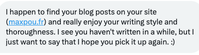

import Info from '../../../../components/MDX/Info.astro'

Last June, my blog turned 10 years old. It all started with a cheat sheet for a PHP framework. I
wanted a place where I could keep track of my experiments. It slowly transitioned into a digital
garden.

And some unexpected things happened:

- I met a guy in Thailand who thanked me for a post about Docker;
- Some posts got translated into Chinese/Japanese;
- I received a lot of “thank you” messages like this
  one:

By the way, thanks for all these lovely messages. It means **a lot** to me 🫶

---

These 10 years are also a good opportunity to look back and see what I learned from this experience.

TL:DR;

1. [A good title is more important than you think](#1---a-good-title-is-more-important-than-you-think)
2. [_“Write like if no one's reading”_](#2---write-like-if-no-ones-reading)
3. [Some posts will blow up, others won't…](3---some-posts-will-blow-up-others-wont)
4. [_“This topic was already covered by XXX”_](4---this-topic-was-already-covered-by-xxx)
5. [Don't overdo](#5---dont-overdo)
6. [Take notes often](#6---take-notes-often)
7. [Own your content](#7---own-your-content)
8. [Consistency is key](#8---consistency-is-key)
9. [Use social platforms](#9---use-social-platforms)
10. [It’s a strategic tool for career growth](#10---its-a-strategic-tool-for-career-growth)

## #1 - A good title is more important than you think

A post title is like a startup name. It needs to “click” and to be unique. It's the first thing the
users will see. Based on that first impression, they will decide whether they click or not. Catching
someone's attention is hard. To stand out from the crowd, a good title is a key to success.

Unfortunately, titles like *“You MUST learn these 3 things to be a 10x developer”* works incredibly
well. I mean it catches the attention, people will click but they won't stay because they're feeling
scammed.

I've found out that actionable and benefit-driven titles work the best.

## #2 - _“Write like if no one's reading”_

I've often fallen into the trap of trying to make some blog posts “perfect”. I ended up spending
months before posting or not posting it at all. It's not an academic dissertation, so it doesn't
have to be perfect!

Write posts that YOU want to read! I don't know how often I reread my article on the
[Set theory in Javascript](https://www.maxpou.fr/blog/no-more-loop-in-js/#set-theory-union--intersection--and-difference)
just because I forgot how it works.

When I write without the pressure to please others, I find myself more authentic and it also reduces
the fear of judgment (our ego is terrified of feedback).

## #3 - Some posts will blow up, others won't…

…and it's fine!

One of my most-read posts is
[“Typical JavaScript interview exercises (explained)”](https://www.maxpou.fr/blog/js-exercises-explained/).
A person wrote some questions he likes to ask during a job interview but didn't tell the answer. So,
I did the exercises and posted the answers with some explanations. I thought it would be good for me
to reread it on my next job hunt. This post was read 20k times!

Another most-read post is
[“How to play Age of Empire II DE on MacOS”](https://www.maxpou.fr/blog/aoe2-on-macos/) (which is
not technical). I published this post in case I had to reinstall the game on a different laptop
(because it's a bit tedious). This post brings 2k monthly readers to my website!

On the other hand, I spent countless hours writing a post about
[monorepos](https://www.maxpou.fr/blog/monorepo-pros-and-cons/). Something that I like to talk
about. This post is one of my least viewed. Maybe I failed at promoting it or the content was too
dense/disorganised… It happens and that's fine!

## #4 - _“This topic was already covered by XXX”_

I didn't post because of this reason. Looking backwards it was a silly excuse.

Probably the easiest excuse not to do something. Publish this post. I'm sure someone on the Internet
will find it useful. Maybe your post will cover a point that someone else doesn't.

As long as your post is not copied/pasted from someone else's blog, publish it!

## #5 - Don't overdo

It's not necessarily meant to be a long post. Shorter is often better!

## #6 - Take notes often

I created a small Kanban in Notion where I can put ideas for my posts. When I have a new idea, I add
it to the draft. Once the critical mass of ideas is reached, I organise my thoughts and hit the
publish button.

Some authors use a paper notebook/notepad. The idea remains the same.

## #7 - Own your content

When you post on a 3rd party platform, you won't get the benefit of your audience. Also, the
platform may evolve in a way that doesn't suit you. Like Medium. The user experience has become very
bad over the years on this platform between the login wall and all the popups.

Creating your platform is distracting. When you're building, you're not creating content. That's why
I started with [a Jekyll theme](https://mmistakes.github.io/jekyll-theme-hpstr/). After 4 years, I
decided to build my platform.

Also, [my blog is open source](https://github.com/maxpou/maxpou.fr). I think it's cool because it
opens the door for collaboration (correcting typos etc.).

<Info title="💡 Beginner tips!">
  A WordPress blog with content is worth more than a whatever-fancy-framework blog with no content.
  Apart from you, not a single person cares about the stack that runs your blog.
</Info>

## #8 - Consistency is key

Considering that over the last 2y, I only wrote 7 posts, this point might sound like a joke. Looking
at my analytics, I had better results when I was writing often.

Showing up regularly is the hardest thing. But people and search engines love it!

## #9 - Use social platforms

Platforms like Reddit and Twitter are good for attracting new readers to your blog. I remember
having good feedback on Reddit when I wrote about Vue.js.

Of course, you will find some toxic people on the way. It's a part of the game when you get
exposure.

## #10 - It's a strategic tool for career growth

My blog is a living portfolio of my work. While my resume is simply listing skills, my blog points
out concrete examples of my skills and accomplishments. It's also a place to showcase other skills
that are not necessarily on my resume.

Additionally, a blog is a good tool to attract the attention of recruiters looking for experts. 3
years ago, I wrote posts about some niche topics like "large Vue.js codebases". Back then, I
received a few offers from companies willing to fix their scaling issues.

---

This blog helped me to grow both personally and professionally. If you haven't started one yet, try
it. I don't think you will regret it!

And, thanks again for reading my work over the last decade :)
