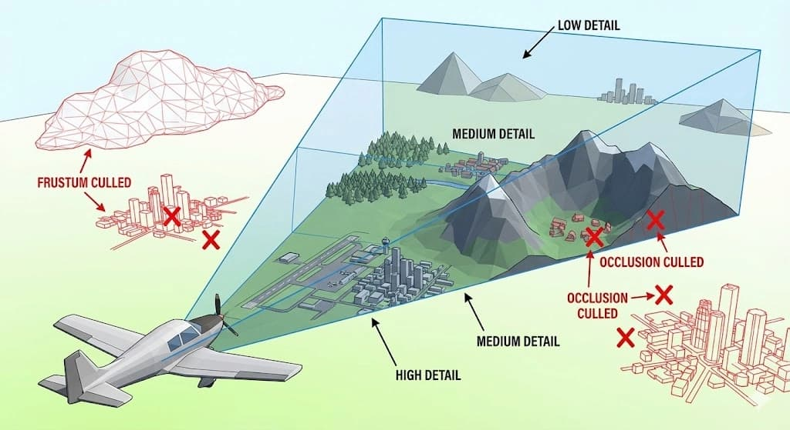
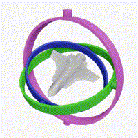
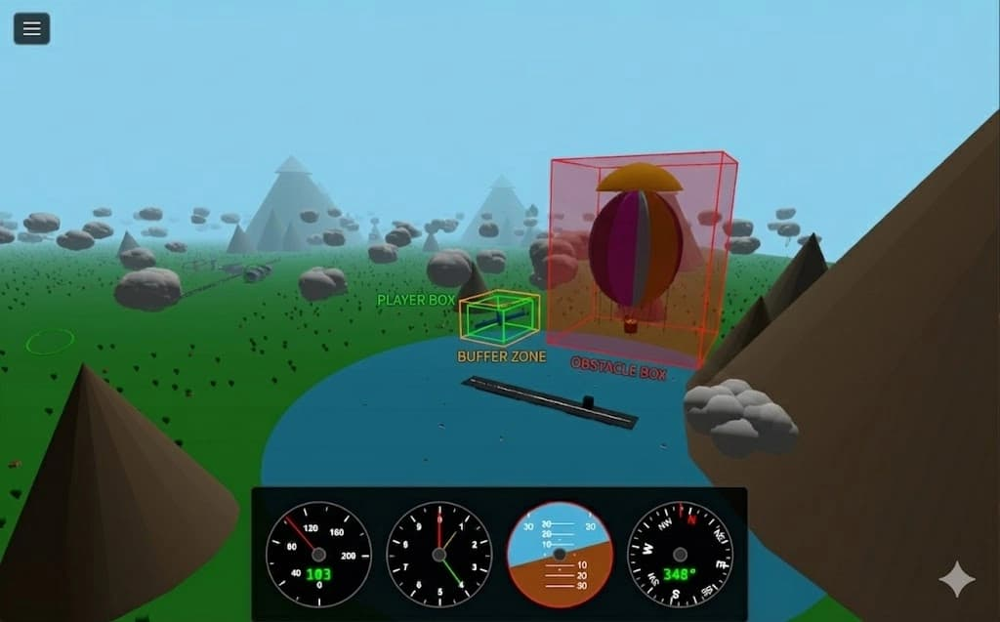

import Info from '../../../../components/MDX/Info.astro'
import myVideo from './frustum.mp4'

Back in the day, I was obsessed with building games—I even coded my first one on a TI-82 calculator!
But I'd never opened the Pandora's box of 3D development; it always felt like the "final boss." Last
year, I used a long train ride as an excuse to finally dive in, using Cursor to see how AI could
level up my workflow.

That's how **Avion**, a 3D flight simulator, was born. What started as a tiny, one-file experiment
escalated quickly. After a year of refining the physics and modularising the UI, the project has
ballooned into a serious codebase: 80 files and 15,000 lines of code!

## Performances is hard

I probably spent most of my time chasing the frame rate (FPS). This is the number of images the user
sees per second. When this number is too low, the game feels laggy and it's frustrating to the user
because the commands are not reacting well.

We consider a game “smooth” when we have 60 FPS (Frames Per Second). In other words, it means that
in 16.6ms the game needs to calculate the flight physics, detect a potential collision, process the
user inputs, move the plane on the board, move the clouds, animate elements…



To prevent the FPS counter from going crazy, I had to implement a few tricks:

- **Level of Details (LOD)**: the farther an object is, the lower quality it will have. In Avion,
  the trees that are too far away will only render a bush. The trunk will be hidden. When you play
  open-world games, and you travel fast, you may have the feeling that a lot of objects appear at
  once. It's usually because the loop was stucks and the LOD didn't refresh at the right pace.
- **Frustum culling**: prevents rendering objects outside the camera view (the frustum).
  <video src={myVideo} loop autoPlay muted></video> *Frustum Culling in the game Horizon: Zero Dawn*
- **Occlusion culler**: It's usually the next step after implementing the frustum culling. In a
  nutshell, if a house is hidden from the screen behind a mountain, there's no point of rendering
  it.
- **Frame skipping**: Instead of detecting collision on every frame, I do it every 3 frames. If the
  plane crashes, the user will know it a bit later. But when you have ~45 frames per second, it
  means the user will know it 0,04s later.
- **Hardware Instancing:** at the beginning of the game, I had in the sky ~350 clouds. Each cloud
  consisted of multiple spheres (20-30). Since the clouds are moving in the sky, the GPU had to draw
  25x350 ≈ 8 750 elements. Every 16.6ms!

  Hardware Instancing is a pattern that fixes this issue. It tells the GPU: "The geometry is a
  constant. The only things that change are the coordinates". Instead of having 1 000 draw calls for
  1 000 clouds, I only have 1! (It can be more if you have multiple variants of clouds).

  <Info>
    💡 This is how games like Minecraft are able to render a huge amount of blocks instantly. This
    is also how crowds are addressed when you play a game in a stadium (FIFA, NBA...).
  </Info>

## Math and Physics… everywhere!

First of all, what makes a plane flight? Physics... it's everywhere!

### **The Rotation Headache**

To navigate in the air, a plane can rotate across nested rings (gimbals), corresponding to one axis
of rotation:

- **Pitch** is the rotation around the aircraft's wings. It makes the nose point up or down.
- **Roll** is the rotation around the aircraft's nose-to-tail axis. It makes the plane roll (like a
  barrel)
- **Yaw** is the rotation around the aircraft's vertical axis. It makes the nose turn left or right.

These 3 angles are also known as Euler angles.

When a plane takes off, all these rings rotate independently up to a point where 2 axes become
perfectly aligned. And it's suddenly impossible to distinguish some of the rotations. I mean, it's
impossible to distinguish between doing a Roll and doing a Yaw. As a result, the plane makes
unwanted movements. This phenomenon is called **Gimbal Lock**.



A solution for this is to use **quaternions**. Instead of using the 3 nested rings, it calculates a
single rotation around an arbitrary axis (which never locks up).

Most game engines, like Unity or Unreal, use quaternions.

### Collision and Crash Detection



Next up was collision detection. It's a fundamental part of any game—it's how you pick up items,
take damage, or interact with the world. The catch? Even a simple game has hundreds of thousands of
elements to check, and it has to happen constantly. To keep things running smoothly, I use a few
tricks:

- **Distance Culling**: If an object is too far away or significantly below the plane, the engine
  ignores it entirely. There is no need to run expensive collision checks with a tree if the player
  is flying 100 meters above the sea.

- **Simplistic shapes:** Instead of checking every complex shape (like a tree made of a cube and
  spheres), I simplify the math. Everything is a box or a sphere. Sometimes the box is smaller than
  the actual object.

  Even the plane has no collision mesh. It's treated as a point with a small radius. It could be
  problematic if the user tries to enter a collision with a wing and a building. But I voluntarily
  put the building far away from the runway. Using a small radius prevents having “phantom crashes”.
  Crashes that happen when the user feels like they didn't actually hit the obstacle. It also
  increases the “Woah, that was close!” effect!

- **AABB Shortcut**: To calculate the distance between two points, we usually use Euclidean Distance
  (based on the Pythagorean theorem). But this can be a bit slow because of the square root.

  I use Axis-Aligned Bounding Boxes (AABB). Basically, it wraps everything into boxes (aligned) and
  checks if the coordinates are overlapping. This is ludicrously fast and takes almost no CPU power.

  ```js
  // Euclidean Approach (Slower)
  function isCollidingEuclidean(objA, objB) {
    const dx = objA.x - objB.x
    const dy = objA.y - objB.y
    const dz = objA.z - objB.z

    // The square root is the "expensive" part
    const distance = Math.sqrt(dx * dx + dy * dy + dz * dz)

    return distance <= 0
  }

  // AABB Shortcut (Faster)
  function isCollidingAABB(a, b) {
    return (
      a.minX <= b.maxX &&
      a.maxX >= b.minX &&
      a.minY <= b.maxY &&
      a.maxY >= b.minY &&
      a.minZ <= b.maxZ &&
      a.maxZ >= b.minZ
    )
  }
  ```

  An alternative is to bypass the expensive square root by comparing squared distances. If you want
  to read more about it, there's
  [a good post about it on the MDN](https://developer.mozilla.org/en-US/docs/Games/Techniques/3D_collision_detection).

## Realism vs Fun

At the beginning, I was tempted to make my game as close to reality as possible. I wanted to build a
real flight simulator, but with a simplistic design.

Slowly, I realised that this scientific accuracy was negatively impacting the fun part of this game.
So I ended up shifting the "cursor" toward something more arcade. And I think it's ok. _First-person
shooters_ or games like GTA would be god damn boring if you have to send your character to the
hospital every time he takes a bullet!

---

Not every optimisation turned out to be a game-changer. Some tricks barely moved the needle. But
beyond the frame rate battles, building Avion was a great excuse to dust off geometry and
trigonometry I hadn't touched since school.

And in the end, my best takeaway? I built something fun, and I still find myself hopping back into
the cockpit to chase some challenges!

Want to try it out? → [avion-game.netlify.app](https://avion-game.netlify.app/)
