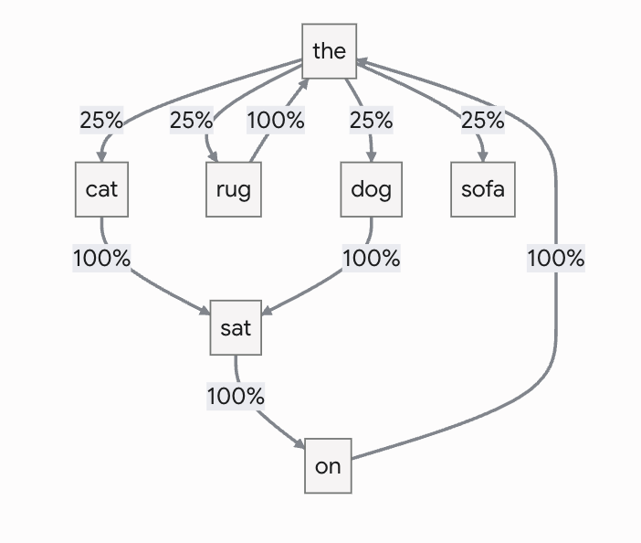

import MarkovChainComponent from '../../../../components/apps/blog/MarkovChainComponent'
import WordAnalogyComponent from '../../../../components/apps/blog/WordAnalogyComponent'

Every time I ask ChatGPT to debug some code or come up with a recipe, I get this weird feeling
there's a tiny someone hidden in my laptop typing the answers. I've been using these tools as black
boxes for years, never really bothering to understand what's happening under the hood.

So I finally took the time to dig into it. Turns out it's a way better story than I expected. Here's
what I found.

## The Turing Test: can machines think?

The story starts before computers could even talk. In 1950, Alan Turing opened his paper _"Computing
Machinery and Intelligence"_ with a question: **"Can machines think?"**. He immediately shrugged
that off as too vague (what does "think" even mean, really?) and swapped it for something more
practical.

He proposed a game, now known as the **Turing Test**:

- A human judge chats (by text) with two hidden participants: one human, one machine
- If the judge can't reliably tell which is which, the machine passes
- No philosophy required

If a machine can hold a conversation indistinguishable from a human's, arguing about whether it
"really" thinks becomes a matter of semantics.

In a nutshell, Turing turned an unanswerable philosophical question into an engineering target.
Conversation became the benchmark for machine intelligence, and for the next 75 years, researchers
chased it.

## ELIZA, the first chatbot

One of the earliest breakthroughs came in 1966, when Joseph Weizenbaum, a researcher at MIT, built
ELIZA, the first chatbot. ELIZA mimicked a psychotherapist using simple pattern matching.
Weizenbaum's bet was pretty simple: write enough `if-then` conditions, and a computer should
theoretically be able to hold a conversation.

```text
ELIZA: Please tell me what's been bothering you.
YOU:   I'm upset about my sister
ELIZA: Tell me more about your family.
```

Here, the program spots the word "sister" and fires a rule to ask about my family. That's the whole
trick: pattern matching, nothing more. And yet people confided in ELIZA. Some got genuinely attached
to it. That phenomenon, trusting a machine's apparent understanding even when you know it's just a
program, later got a name: the **ELIZA effect**. Still shapes how we react to chatbots today.

ELIZA proved that even dumb language tricks could make a computer look intelligent. But language is
infinite, and you can't write enough `if-then` rules to cover every possible conversation. At some
point you have to stop hardcoding and try something else.

## Markov chains enter the chat

After ELIZA, researchers kept experimenting with conversational programs like PARRY or ALICE. Same
limitation, new coat of paint: still built on predefined rules and scripted responses.

Statistical methods for generating text were the next move. One of the most influential ideas was
the **Markov chain**: a mathematical model that predicts the next item in a sequence based only on
the current state.

Let's take the following training text:

```text
The cat sat on the rug. The dog sat on the sofa.
```

The Markov model builds a matrix like this, where after the keyword "the", there's a 25% chance of
getting the keyword "dog":



Ask it to generate a sentence, and you may end up with something like `"The dog sat on the cat"`.
Not exactly Shakespeare, but hey, at least it's not scripted.

Try it yourself! Tweak the training text and generate a few sentences to see how the model's
"choices" are really just a weighted coin flip:

<MarkovChainComponent client:visible />

This is probably close to the algorithm behind your phone's virtual keyboard when it predicts the
next word.

Markov models had one big limitation though: they could only remember a tiny bit of context. Ask one
to write a few sentences about your sister, and it might randomly switch to "he" instead of "she".
That's because it only looks at the previous word (or a small handful of them), with no real memory
of what the text was actually about.

Still, despite the shortcomings, Markov chains were a real turning point. They proved computers
could **learn statistical patterns directly from data**, instead of being spoon-fed rules.

## Neural networks: learning instead of programming

The real breakthrough came with **neural networks**, a type of machine learning loosely inspired by
the human brain. Instead of relying on pre-programmed rules, neural networks learn from data. This
shift is what let computers pick up language patterns instead of just following scripts.

In 2013, researchers at Google introduced Word2Vec, a small neural network that represented words as
vectors (lists of numbers). Suddenly, words with similar meanings ended up close together in space.
Word2Vec is basically J.R. Firth's linguistic principle turned into code: _"You shall know a word by
the company it keeps."_

Instead of needing human-labelled data, Word2Vec automatically generates its own training samples by
sliding a window over raw, unannotated text:

```js
// Dimension 1: Royalty / Power
// Dimension 2: Gender (Higher = Female)
// Dimension 3: Object vs. Concept / Concrete Nature

const vocabulary = {
  king: [0.9, 0.1, 0.2],
  queen: [0.92, 0.88, 0.22],
  man: [0.2, 0.1, 0.15],
  woman: [0.21, 0.89, 0.16],
  prince: [0.75, 0.12, 0.4],
  princess: [0.77, 0.87, 0.42],
  throne: [0.85, 0.48, 0.85],
  crown: [0.88, 0.5, 0.82],
  apple: [0.05, 0.5, 0.95],
  fruit: [0.02, 0.48, 0.9],
  chair: [0.1, 0.5, 0.8],
}
```

Kind of like reading a chromatogram, but with way more dimensions.

With this, you can do linear vector arithmetic to solve analogies like:

```text
King – Man + Woman ≈ Queen
```

Give it a try! Pick three words and see what the maths spits out:

<WordAnalogyComponent client:visible />

Which, the first time I understood it, honestly blew my mind. This was the first time computers
**captured relationships between words**, not just how often they showed up together.

The catch? Word2Vec produces **static embeddings**. Each word gets exactly one fixed vector. So
"bank" has the same vector every single time, whether we're talking about a bank account or the bank
of a river.

## The Transformer architecture

The next step was **recurrent networks** (RNNs and LSTMs), which read text word by word while
carrying a memory of everything that came before — stretching the context way past a Markov chain's
tiny window. By the mid-2010s they were powering translation and autocomplete, but they had two
annoying weaknesses:

- Their memory faded over long passages
- Reading word by word meant they couldn't be trained in parallel — painfully slow

Then, in 2017, a team at Google published a paper with a title that's basically a mic drop:
_"Attention Is All You Need"_. It introduced the **Transformer** (yes, the "T" in ChatGPT), an
architecture that ditches word-by-word reading entirely. Through a mechanism called _attention_,
every word in a passage can directly look at every other word and decide which ones actually matter.

Let's take these two sentences:

1. _"The animal didn't cross the street because **it** was too tired."_
2. _"The animal didn't cross the street because **it** was too wide."_

Instead of reading sequentially, a Transformer processes every word at once. When evaluating the
word "it", the model lets "it" look at all the other words in the sentence simultaneously and
calculates an "attention score" for each one:

- Sentence 1: when "it" looks at "tired", attention builds a strong connection back to "animal".
  Weights: `it` → `animal` (0.85), `street` (0.10), `cross` (0.05)
- Sentence 2: when "it" looks at "wide", the connection shifts to "street" instead. Weights: `it` →
  `street` (0.82), `animal` (0.12), `cross` (0.06)

Same sentence structure, same pronoun, completely different answer, because the model actually
weighs context instead of just following word order. And the Transformer isn't only about accuracy,
it's also about **scalability**: since everything can be processed in parallel, these models can be
trained on massive datasets using massive clusters of hardware.

## From text predictors to ChatGPT

That's exactly what OpenAI did with the GPT series (Generative Pre-trained Transformer): take a
Transformer, train it on a colossal amount of text, and give it the humblest objective imaginable:
**guess the next word**. Turns out, making these models bigger and feeding them more text didn't
just improve them gradually. It kept unlocking abilities nobody explicitly trained for: translation,
summarisation, arithmetic... even writing code!

But a raw text predictor doesn't really converse. Ask it a question and it might just keep going
with more questions, because that's a plausible way for the text to continue. The missing piece was:

- **Instruction tuning** — teaching the model to follow instructions instead of just completing text
- **RLHF** (Reinforcement Learning from Human Feedback) — humans rate the model's answers, and the
  model gets fine-tuned to prefer responses that are helpful, relevant, and polite

That's the step that turned a next-word predictor into the assistant helping me with my recipes, and
it's exactly why it feels like there's a little someone in my laptop. There isn't. It's still
next-word prediction under the hood, just shaped by human feedback to act like a conversation
partner.

Nowadays, most Large Language Models (LLMs) like GPT, Claude, Gemini, Mistral... rely on this same
architecture. And in 2025, 75 years after Turing's paper, researchers at UC San Diego reported that
GPT-4.5, prompted to adopt a humanlike persona, passed a proper three-party Turing Test — judged
human 73% of the time, more often than the actual humans it was up against. The engineering target
Turing proposed 75 years ago has officially been hit.

## No grand theory of mind required

What gets me is that none of this needed a grand theory of mind or a hand-built model of grammar.
The winning formula was the dumbest idea in the whole story (guess the next word), pushed to its
limit with enough data, enough compute, and one architectural insight about attention.

Not that different from how kids pick up language: by listening and absorbing patterns, no grammar
textbook required. Machines just need a lot more examples to get there.

## Further reading

- [The Illustrated Word2vec](https://jalammar.github.io/illustrated-word2vec/) - Jay Alammar
- [Attention Is All You Need](https://arxiv.org/abs/1706.03762) - the original Transformer paper
- [Large Language Models pass the Turing Test](https://arxiv.org/abs/2503.23674) - Jones & Bergen,
  2025
- [From GPT2 to Kimi3, Explained](https://x.com/waterloo_intern/status/2081762065392541951) - Ali
  Taha
