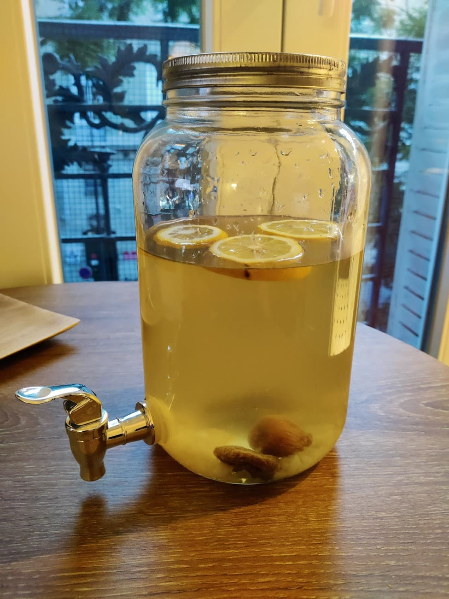

## Ingredients (for 1L)

- 1L water
- 3 tablespoons of Kefir grain
- 3.5 tablespoons of organic blond cane sugar
- 2-3 figs
- 1/3 lemon
- 2 inches of roughly chopped ginger

## Optionals

1 other fresh / dried fruit (grape, strawberry, raspberry, cranberry, mango, apple, pear... it's up
to you.

Herbs like basil really works well!

## Steps

1. Put everything in a jar
2. Let is rest for 24h at room temperature. It’s called Fermentation 1 (or F1). You know it’s ready
   when the figs rise to the surface.
3. Transfert everything in a glass bottle. Leave some room for gas.
4. Let is rest for another 24h at room temperature. It’s called Fermentation 2 (or F2). You should
   expect some gas when you open the bottle.
5. Put it in the fridge and enjoy it!

