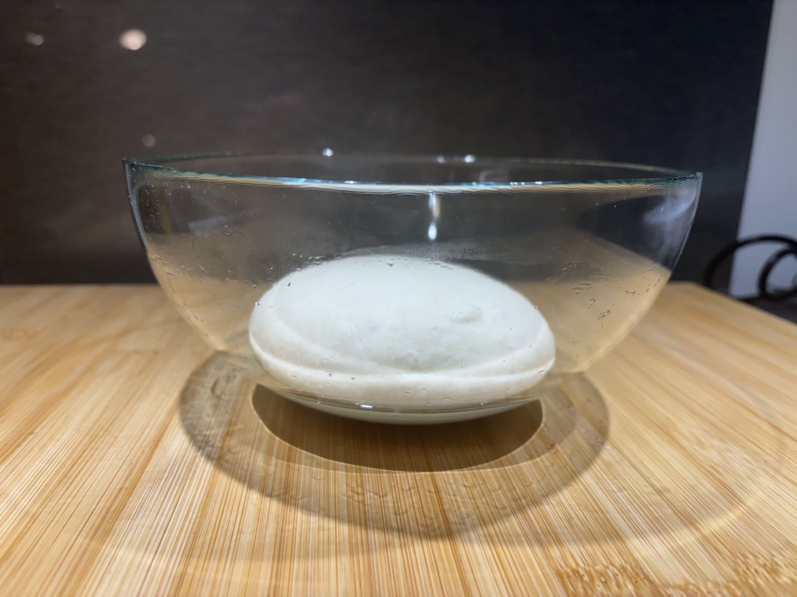
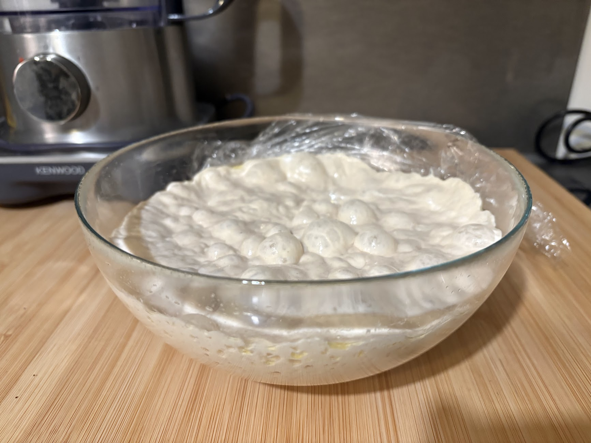
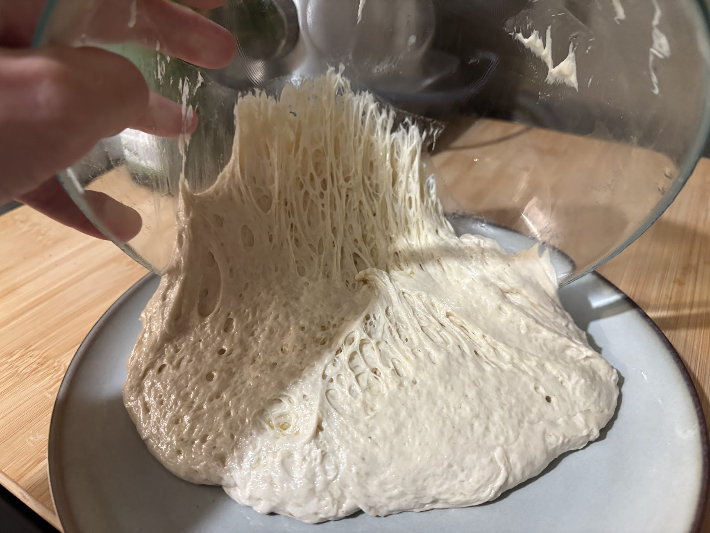

## Dough - 48h fermentation - 65% hydration

### Ingredients - for 2 doughs of 250g ~30cm

- 298g flour typo 00
- 193g water (cold)
- 0.9g yeast
- 9g salt

### Steps:

1.  **Mixing the dough** In a big bowl, dissolve the yeast in the water. Gradually add the flour.
    You can mix with a spoon (to keep your hands clean!). When the mixture is still liquid, add the
    yeast. Drop the spoon when the dough becomes too firm. Use your hands and knead till it’s smooth
    and elastic.

        

2.  **Bulk fermentation (or first rise)** Fold the edges underneath and pinch the bottom to create
    tension in the surface. Rest for 1-2h at room temperature.
3.  **Cold fermentation** Knead the dough for ~10mins. Then, lightly grease the bowl with olive oil
    (to make it easier to remove the dough) and put the dough in it. Rest for 24, or ideally 48h in
    the fridge

        

        

4.  **Balling and second rise** 4h Before eating, divide the dough into 2 balls. Fold the edges
    underneath and pinch the bottom to create tension in the surface. Leave the balls at room
    temperature

## Dough express - 3h fermentation - 65% hydration

For 2 doughs of 250g (~30cm)

- 298g flour typo 00
- 193g water
- 2.5g yeast
- 9g salt

_Since we don’t have 24h, we need more yeast to speed up the process!_

The steps are more or less the same as the 48h fermentation, but we remove the cold fermentation.

1. **Mixing the dough** Mix all the ingredients. Knead for 10-15 minutes until it’s smooth and
   elastic. Let the dough rest for 15 minutes.
2. **First rise** Fold the sides down and pinch the base to create surface tension. Rest for 1h
3. **Second rise** Divide the dough into 2 balls. Fold the sides down and pinch the base to create
   surface tension. Rest for 2h

## Pizza time!

1. Pre-heat the oven to maximum temperature (+400°C)
2. Dust the surface with durum wheat semolina (extra-fine), then stretch the dough-ball on it.
3. Add the ingredients:
   1. Spread a thin layer of tomato
   2. add torn mozzarella
   3. Add diced mushrooms
   4. …
   5. end with a drizzle of extra virgin olive oil
4. Bake for ~90 seconds
