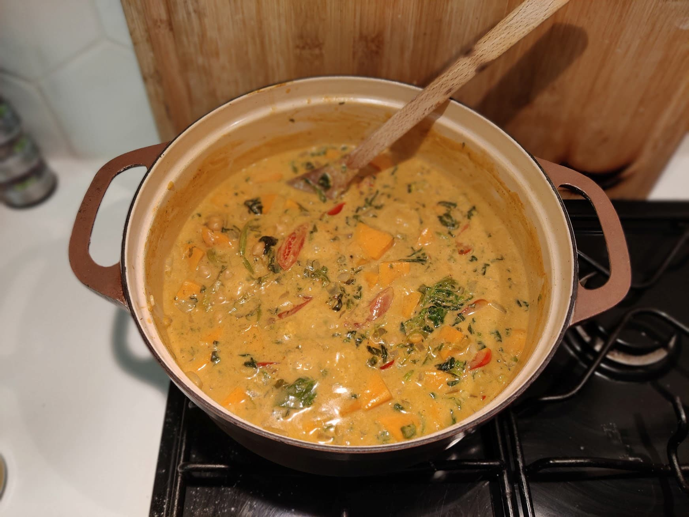

## Ingredients: (3/4 persons)

- 1 can of coconut milk or coco cream (400ml)
- 1 big onion (diced)
- Curry paste (~3 tablespoon) + curry powder & garam masala
- Chickpeas (400g)
- Spinaches (200g)
- 1-2 sweet potatoes
- 2-3 garlic cloves
- Ginger (2 - 2.5cm)
- Tomato paste (1 tablespoon)
- water or veggie stock (60ml)
- 1 hot chili pepper
- Coco oil
- salt, pepper

## Optional ingredients

- tomatoes
- cauliflower
- Potatoes (as replacement for sweet potatoe)

## Steps

1. Temper spices.
2. Add the curry paste and the diced onion. 5mins
3. Add garlic, ginger and tomato paste - 3 mins
4. Add the sweet potatoes (diced) - 3mins
5. Add coconut milk, water, hot chilli pepper, chickpeas and spinach.
6. When it starts boiling, reduce heat to the minimum. Simmer for 20mins.
7. Before serving adjust the seasoning (salt&pepper)
8. Serve with rice

